# Development Roadmap - Visual Overview

## 4-Week Sprint Plan

## Parallel Development Visualization

## Workstream Dependencies

```mermaid
flowchart TD
    Start[Foundation Complete ✓] --> W1[Week 1: Spike]

    W1 --> |Discovers needs| W2[Week 2: Infrastructure]

    W2 --> |Enables| W3A[Week 3: PDF]
    W2 --> |Enables| W3B[Week 3: PPTX]
    W2 --> |Enables| W3C[Week 3: Processors]
    W2 --> |Enables| W3D[Week 3: Formatters]
    W2 --> |Enables| W3E[Week 3: Pipeline++]

    W3A --> W4X[Week 4: Integration]
    W3B --> W4X
    W3C --> W4X
    W3D --> W4X
    W3E --> W4X

    W2 --> W4A[Week 4: Excel]
    W3E --> W4B[Week 4: Batch]
    W4X --> W4C[Week 4: CLI]

    W4A --> W4C
    W4B --> W4C

    W4C --> MVP[MVP Ready 🚀]

    style Start fill:#90EE90
    style W1 fill:#87CEEB
    style W2 fill:#FFD700
    style W3A fill:#DDA0DD
    style W3B fill:#DDA0DD
    style W3C fill:#DDA0DD
    style W3D fill:#DDA0DD
    style W3E fill:#DDA0DD
    style MVP fill:#90EE90
```

## Module Interaction Architecture

## Pipeline Data Flow

## Risk Heat Map

## Progress Tracking Dashboard

```mermaid
graph TD
    subgraph "Completion Status"
        C1[Foundation ✓ 100%]
        C2[Week 1 □ 0%]
        C3[Week 2 □ 0%]
        C4[Week 3 □ 0%]
        C5[Week 4 □ 0%]
    end

    subgraph "Current Sprint: Week 1"
        S1[DocxExtractor □ 0%]
        S2[Infrastructure □ 0%]
        S3[Pipeline MVP □ 0%]
    end

    subgraph "Blockers"
        B1[None]
    end

    subgraph "Next Actions"
        N1[Create extractors/ directory]
        N2[Install python-docx]
        N3[Begin DocxExtractor implementation]
    end

    style C1 fill:#90EE90
    style C2 fill:#FFD700
```

## Test Coverage Goals

## Delivery Milestones

## MCP Coordination Structure

## Quick Win Timeline (Week 1 Detail)

```mermaid
gantt
    title Week 1 - Detailed Timeline
    dateFormat HH:mm
    axisFormat %H:%M

    section Day 1
    Setup Environment           :d1a, 00:00, 1h
    DocxExtractor Structure     :d1b, after d1a, 2h
    Basic Text Extraction       :d1c, after d1b, 3h
    Initial Testing             :d1d, after d1c, 2h

    section Day 2
    Heading Detection           :d2a, 00:00, 2h
    Paragraph Parsing           :d2b, after d2a, 3h
    Unit Tests                  :d2c, after d2b, 3h

    section Day 3
    Table Extraction            :d3a, 00:00, 3h
    Image Metadata              :d3b, after d3a, 2h
    Edge Cases                  :d3c, after d3b, 3h

    section Day 4
    MetadataAggregator          :d4a, 00:00, 3h
    JsonFormatter               :d4b, after d4a, 2h
    Pipeline Structure          :d4c, after d4b, 3h

    section Day 5
    Pipeline Integration        :d5a, 00:00, 3h
    End-to-End Testing          :d5b, after d5a, 2h
    Demo Preparation            :d5c, after d5b, 2h
    Documentation               :d5d, after d5c, 1h
```

## Success Metrics Dashboard

---

## Legend

**Status Colors**:
- 🟢 Green: Complete
- 🟡 Yellow: In Progress / Critical Path
- 🟣 Purple: Parallel Development
- 🔵 Blue: Infrastructure / Enabler

**Priority Levels**:
- **P0**: Must have for MVP
- **P1**: Should have for MVP
- **P2**: Nice to have for MVP
- **P3**: Future enhancement

**Dependencies**:
- `-->` Sequential dependency
- `-.->` Optional dependency
- `==>` Strong coupling

---

**Document Version**: 1.0
**Last Updated**: 2025-10-29
**Related**: COORDINATION_PLAN.md, CLAUDE.md
