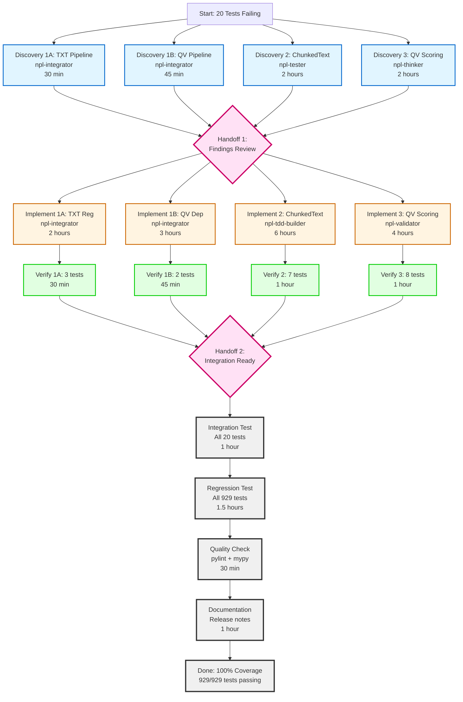

# Test Remediation Workflow Visualization

**Visual guide to parallel execution and dependencies**

---

## Dependency Graph



---

## Timeline Gantt Chart

```
Phase 1: Discovery (Parallel - Hours 0-2)
├─ [npl-integrator] TXT Discovery         ▓▓░░░░░░░░░░░░░░░░░░░░  (0.5h)
├─ [npl-integrator] QV Discovery          ▓▓▓░░░░░░░░░░░░░░░░░░░  (0.75h)
├─ [npl-tester]     Chunked Discovery     ▓▓▓▓▓▓▓▓░░░░░░░░░░░░░░  (2h)
└─ [npl-thinker]    Quality Discovery     ▓▓▓▓▓▓▓▓░░░░░░░░░░░░░░  (2h)
                                           └─ HANDOFF 1 (Hour 2)

Phase 2: Implementation (Parallel - Hours 2-10)
├─ [npl-integrator] TXT Implementation    ░░▓▓▓▓░░░░░░░░░░░░░░░░  (2h, Hours 2-4)
├─ [npl-integrator] QV Implementation     ░░▓▓▓▓▓▓░░░░░░░░░░░░░░  (3h, Hours 2-5)
├─ [npl-tdd-builder] Chunked Impl         ░░▓▓▓▓▓▓▓▓▓▓▓▓░░░░░░░░  (6h, Hours 2-8)
└─ [npl-validator]  Quality Impl          ░░▓▓▓▓▓▓▓▓░░░░░░░░░░░░  (4h, Hours 2-6)

Phase 2: Verification (Parallel - Hours 4-9)
├─ [npl-integrator] TXT Verify            ░░░░▓░░░░░░░░░░░░░░░░░  (0.5h, Hours 4-4.5)
├─ [npl-integrator] QV Verify             ░░░░░▓▓░░░░░░░░░░░░░░░  (0.75h, Hours 5-5.75)
├─ [npl-tdd-builder] Chunked Verify       ░░░░░░░░▓▓░░░░░░░░░░░░  (1h, Hours 8-9)
└─ [npl-validator]  Quality Verify        ░░░░░░▓▓░░░░░░░░░░░░░░  (1h, Hours 6-7)
                                           └─ HANDOFF 2 (Hour 9)

Phase 3: Integration (Sequential - Hours 9-14)
├─ Integration Test (20 tests)            ░░░░░░░░░▓▓░░░░░░░░░░░  (1h, Hours 9-10)
├─ Regression Test (929 tests)            ░░░░░░░░░░▓▓▓░░░░░░░░░  (1.5h, Hours 10-11.5)
├─ Quality Check                          ░░░░░░░░░░░░▓░░░░░░░░░  (0.5h, Hours 11.5-12)
└─ Documentation                          ░░░░░░░░░░░░▓▓░░░░░░░░  (1h, Hours 12-13)

Phase 4: Release (Sequential - Hours 13-15)
├─ Version Bump & Build                   ░░░░░░░░░░░░░▓░░░░░░░░  (0.5h, Hours 13-13.5)
├─ Wheel Testing                          ░░░░░░░░░░░░░▓░░░░░░░░  (0.5h, Hours 13.5-14)
└─ Git Tag & Deploy                       ░░░░░░░░░░░░░░▓░░░░░░░  (0.5h, Hours 14-14.5)

Total Wall Time: 12-15 hours (with 3-agent parallelization)
Total Effort:    19-27 hours (sum of all agent hours)

Legend:
▓ = Active work
░ = Waiting/Idle
```

---

## Critical Path Analysis

**Critical Path** (longest sequential chain): 14.5 hours

```
Start
  ↓ (2 hours)
Discovery Phase (slowest: ChunkedText/Quality @ 2h)
  ↓ (0 hours - parallel handoff)
HANDOFF 1
  ↓ (6 hours)
Implementation (slowest: ChunkedText @ 6h)
  ↓ (1 hour)
Verification (slowest: ChunkedText @ 1h)
  ↓ (0 hours - parallel handoff)
HANDOFF 2
  ↓ (4 hours)
Integration Testing (sequential: 1h + 1.5h + 0.5h + 1h)
  ↓ (1.5 hours)
Release Preparation (sequential: 0.5h + 0.5h + 0.5h)
  ↓
DONE

Critical Path: 2h + 6h + 1h + 4h + 1.5h = 14.5 hours
```

**Optimization Opportunities**:
1. ✅ Already maximized: Discovery, Implementation, and Verification are fully parallelized
2. ✅ Documentation can start during Integration Testing (save 0.5-1h)
3. ⚠️ Integration Testing MUST be sequential (testing for conflicts)

**Fastest Possible Time**: **12 hours** (if documentation overlaps with integration testing)

---

## Resource Allocation

### 3-Agent Scenario (RECOMMENDED)

```
Agent 1 (@npl-integrator)
│
├─ Hour 0-2:    Discovery (TXT + QV)
├─ Hour 2-5:    Implementation (TXT + QV)
├─ Hour 5-6:    Verification (TXT + QV)
├─ Hour 6-9:    💤 Idle (waiting for others)
├─ Hour 9-14:   🤝 Support integration testing
└─ Hour 14-15:  🤝 Release preparation

Total Active: 6 hours
Total Idle: 3 hours
Utilization: 67%


Agent 2 (@npl-tdd-builder)
│
├─ Hour 0-2:    💤 Idle (or assisting npl-tester)
├─ Hour 2-8:    Implementation (ChunkedText)
├─ Hour 8-9:    Verification (ChunkedText)
├─ Hour 9-14:   🤝 Support integration testing
└─ Hour 14-15:  🤝 Release preparation

Total Active: 8 hours
Total Idle: 2 hours
Utilization: 80%


Agent 3 (@npl-validator + @npl-thinker)
│
├─ Hour 0-2:    Discovery (Quality scoring - @npl-thinker)
├─ Hour 2-6:    Implementation (Quality scoring - @npl-validator)
├─ Hour 6-7:    Verification (Quality scoring)
├─ Hour 7-9:    💤 Idle (waiting for others)
├─ Hour 9-14:   🤝 Support integration testing
└─ Hour 14-15:  🤝 Release preparation

Total Active: 7 hours
Total Idle: 3 hours
Utilization: 70%
```

**Overall Resource Utilization**: 72% (good for parallel workflow)

---

### 2-Agent Scenario

```
Agent 1 (@npl-integrator)
│
├─ Hour 0-2:    Discovery (TXT + QV)
├─ Hour 2-5:    Implementation (TXT + QV)
├─ Hour 5-6:    Verification (TXT + QV)
├─ Hour 6-18:   💤 Idle (waiting for Agent 2)
├─ Hour 18-23:  🤝 Support integration testing
└─ Hour 23-24:  🤝 Release preparation

Total Active: 6 hours
Total Idle: 12 hours
Utilization: 33% ❌ (inefficient)


Agent 2 (@npl-tdd-builder + @npl-validator)
│
├─ Hour 0-2:    Discovery (Chunked + Quality)
├─ Hour 2-8:    Implementation (ChunkedText)
├─ Hour 8-9:    Verification (ChunkedText)
├─ Hour 9-13:   Implementation (Quality scoring)
├─ Hour 13-14:  Verification (Quality scoring)
├─ Hour 14-19:  🤝 Integration testing
└─ Hour 19-20:  🤝 Release preparation

Total Active: 18 hours
Total Idle: 0 hours
Utilization: 100%
```

**Overall Resource Utilization**: 60% (poor balance)

---

### 1-Agent Scenario

```
Agent 1 (All Work)
│
├─ Hour 0-2:    Discovery (all workstreams)
├─ Hour 2-4:    Implementation (TXT)
├─ Hour 4-5:    Verification (TXT)
├─ Hour 5-8:    Implementation (QV pipeline)
├─ Hour 8-9:    Verification (QV pipeline)
├─ Hour 9-15:   Implementation (ChunkedText)
├─ Hour 15-16:  Verification (ChunkedText)
├─ Hour 16-20:  Implementation (Quality scoring)
├─ Hour 20-21:  Verification (Quality scoring)
├─ Hour 21-26:  Integration testing
└─ Hour 26-27:  Release preparation

Total: 27 hours (wall time = effort time)
Utilization: 100%
```

**Recommendation**: **3-agent scenario** for optimal speed/efficiency balance

---

## Communication Checkpoints

### Checkpoint 1: After Discovery (Hour 2)

**Purpose**: Confirm root causes and implementation specs

**Attendees**: All agents

**Agenda** (15 minutes):
1. Each agent presents findings (5 min each)
   - Root cause confirmed?
   - Implementation approach clear?
   - Any blockers or risks?
2. Identify cross-dependencies (2 min)
3. Approve Phase 2 start (1 min)

**Deliverables**:
- ✅ Discovery notes uploaded
- ✅ Implementation specs reviewed
- ✅ Phase 2 greenlit

---

### Checkpoint 2: After Implementation (Hour 9)

**Purpose**: Verify all tests passing before integration

**Attendees**: All agents

**Agenda** (20 minutes):
1. Each agent reports test results (5 min each)
   - Unit tests passing?
   - Regressions detected?
   - Code quality checks passed?
2. Review integration test plan (2 min)
3. Assign integration testing roles (2 min)

**Deliverables**:
- ✅ All unit tests passing (20/20)
- ✅ No regressions detected
- ✅ Integration test plan approved

---

### Checkpoint 3: After Integration (Hour 14)

**Purpose**: Final verification before release

**Attendees**: All agents + project coordinator

**Agenda** (15 minutes):
1. Integration test results (5 min)
   - All 929 tests passing?
   - Performance impact measured?
   - Documentation complete?
2. Release readiness review (5 min)
   - Version bumped?
   - Wheel built and tested?
   - Release notes complete?
3. Deployment approval (5 min)

**Deliverables**:
- ✅ 100% test coverage achieved
- ✅ Release package ready
- ✅ Deployment approved

---

## Risk Heat Map

```
             Impact
             │
        High │  ❌ ChunkedText    ⚠️ Regressions
             │  JSON Format      in Pipeline
             │  Breaking Users   Tests
             │
      Medium │  ⚠️ QV Scoring    ⚠️ QV Dependency
             │  Algorithm        Circular Dep
             │  Mismatch
             │
         Low │  ✅ TXT Pipeline  ✅ Timeline
             │  Registration     Overrun
             │
             └─────────────────────────────────
                Low    Medium    High
                     Probability
```

**Legend**:
- ❌ High Risk: Immediate mitigation required
- ⚠️ Medium Risk: Monitor closely, have contingency
- ✅ Low Risk: Standard precautions

---

## Success Visualization

### Before v1.0.7

```
Test Coverage: 93.9% ████████████████████░░
                      872/929 tests

Failing Tests by Category:
├─ TXT Pipeline:           ███ 3 tests
├─ QV Pipeline:            ██ 2 tests
├─ ChunkedText Edges:      ███████ 7 tests
└─ Quality Scoring:        ████████ 8 tests

Status: 🟡 Production Ready (with known gaps)
```

### After v1.0.7

```
Test Coverage: 100% ██████████████████████
                     929/929 tests

Failing Tests by Category:
├─ TXT Pipeline:           ✅ 0 tests
├─ QV Pipeline:            ✅ 0 tests
├─ ChunkedText Edges:      ✅ 0 tests
└─ Quality Scoring:        ✅ 0 tests

Status: 🟢 Production Ready (100% coverage)
```

---

## Parallel Execution Benefits

### Time Savings

```
Sequential Execution:   ▓▓▓▓▓▓▓▓▓▓▓▓▓▓▓▓▓▓▓▓▓▓▓▓▓▓▓ 27 hours
                        │                          │
Parallel (3 agents):    ▓▓▓▓▓▓▓▓▓▓▓▓ 12-15 hours
                        │           │
                        └─ 56% time savings ─────┘
```

### Agent Workload Distribution

```
Sequential (1 agent):
Agent 1: ▓▓▓▓▓▓▓▓▓▓▓▓▓▓▓▓▓▓▓▓▓▓▓▓▓▓▓ 27h

Parallel (3 agents):
Agent 1: ▓▓▓▓▓▓ 6h (TXT + QV pipeline)
Agent 2: ▓▓▓▓▓▓▓▓ 8h (ChunkedText)
Agent 3: ▓▓▓▓▓▓▓ 7h (Quality scoring)

Efficiency: 27h work / 15h time = 1.8x speedup
```

---

## Monitoring Dashboard

**Track progress with this dashboard** (update hourly):

```
┌─────────────────────────────────────────────────────────────┐
│ Test Remediation Dashboard - v1.0.7                        │
├─────────────────────────────────────────────────────────────┤
│                                                             │
│ Overall Progress:    ████████████░░░░  60% (12/20 tests)  │
│                                                             │
│ Agent 1 (integrator):   ████████████████  100% (5/5 done) │
│ Agent 2 (tdd-builder):  ████████░░░░░░░░   50% (4/7 done) │
│ Agent 3 (validator):    ████░░░░░░░░░░░░   25% (2/8 done) │
│                                                             │
│ Phase Status:                                               │
│   ✅ Phase 1: Discovery Complete                           │
│   🔄 Phase 2: Implementation In Progress                   │
│   ⏳ Phase 3: Integration Pending                          │
│   ⏳ Phase 4: Release Pending                              │
│                                                             │
│ Critical Metrics:                                           │
│   Tests Passing:     884/929 (+12 from start)              │
│   Regressions:       0 ✅                                   │
│   Blockers:          0 ✅                                   │
│   ETA to 100%:       6 hours                                │
│                                                             │
└─────────────────────────────────────────────────────────────┘

Last Updated: 2025-11-06 14:30 UTC
Next Checkpoint: Hour 9 (Integration Handoff)
```

---

## Next Actions

1. **Assign agents** to workstreams (use 3-agent scenario)
2. **Set up communication channel** (#test-remediation)
3. **Start Phase 1** discovery in parallel
4. **Schedule Checkpoint 1** for Hour 2
5. **Monitor progress** using dashboard template

**Ready to execute? Let's achieve 100% test coverage! 🎯**
