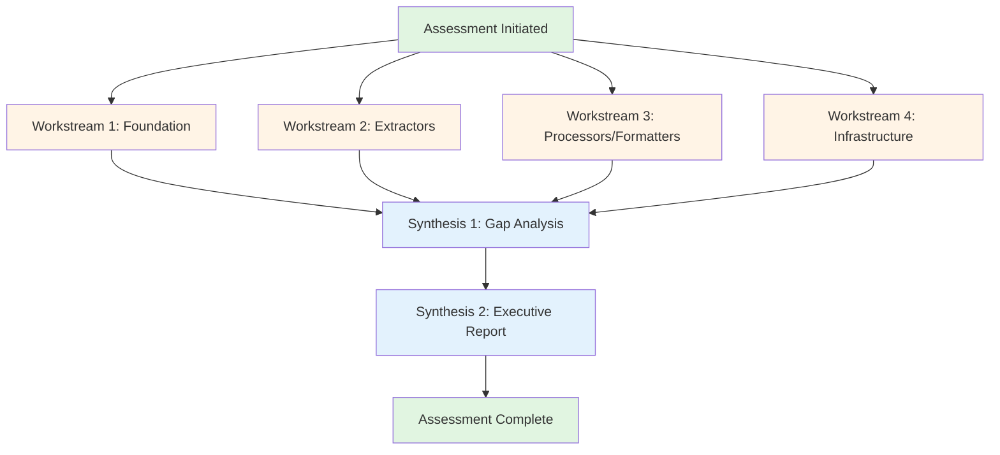

# NPL Agent Orchestration Plan: ADR Assessment

**Created**: 2025-10-29
**Purpose**: Comprehensive assessment of data-extractor-tool implementation against Architecture Decision Records (ADRs)
**Scope**: Evaluate Waves 1-4 implementation for architectural alignment, feature completeness, and contract compliance
**Status**: Ready for Execution

---

## Executive Summary

### Assessment Objective
Systematically evaluate the data-extractor-tool implementation (24 modules, 400+ tests, Waves 1-4) against its architectural specifications defined in ADRs to identify:
- Architectural alignment gaps
- Missing or incomplete features
- Contract compliance issues
- Over-implementations
- Documentation accuracy

### Orchestration Strategy
Deploy **6 specialized NPL agents** across **4 parallel workstreams** with **2 synthesis stages** to achieve comprehensive assessment in minimal time. Leverage parallel execution where dependencies allow, with clear handoff points for sequential assessments.

### Expected Outcomes
1. **Architectural Alignment Report** - How well does code match ADR design patterns?
2. **Feature Completeness Matrix** - Which ADR requirements are implemented/missing?
3. **Contract Compliance Audit** - Do implementations honor interface contracts?
4. **Testing Coverage Assessment** - Does testing meet ADR requirements?
5. **Infrastructure Integration Report** - Are INFRA-001 through INFRA-004 properly used?
6. **Gap Analysis & Recommendations** - Prioritized list of gaps and suggested remediation

### Timeline Estimate
- **Parallel Phase**: 2-4 hours (6 agents working concurrently)
- **Synthesis Phase**: 1-2 hours (aggregation and recommendations)
- **Total**: 3-6 hours for comprehensive assessment

---

## Assessment Dimensions

### Dimension 1: Architectural Alignment
**Question**: Does the implementation follow ADR-specified design patterns?

**Evaluation Criteria**:
- Immutability patterns (frozen dataclasses)
- Type safety (full type hints)
- Clear contracts (ABC implementations)
- Result type separation (ExtractionResult → ProcessingResult → FormattedOutput → PipelineResult)
- Error handling patterns (return success/failure, don't raise for expected errors)
- Extensibility via metadata dicts

**Critical ADR Sections**:
- FOUNDATION.md: Lines 15-55 (Core Principles)
- FOUNDATION.md: Lines 56-91 (Data Models)
- FOUNDATION.md: Lines 271-322 (Design Decisions)

### Dimension 2: Feature Completeness
**Question**: Are all ADR-specified features implemented?

**Evaluation Criteria**:
- All data models present (ContentBlock, Position, metadata types)
- All interface contracts implemented (BaseExtractor, BaseProcessor, BaseFormatter, BasePipeline)
- All extractors specified (DOCX, PDF, PPTX, Excel)
- All processors specified (ContextLinker, MetadataAggregator, QualityValidator)
- All formatters specified (JSON, Markdown, ChunkedText)
- All infrastructure components (INFRA-001 through INFRA-004)

**Critical ADR Sections**:
- FOUNDATION.md: Lines 56-111 (Data Models)
- FOUNDATION.md: Lines 112-173 (Interface Contracts)
- INFRASTRUCTURE_NEEDS.md: Lines 9-191 (Critical Infrastructure)

### Dimension 3: API Contract Compliance
**Question**: Do implementations match specified interface contracts?

**Evaluation Criteria**:
- Required methods implemented
- Correct signatures (Path → ExtractionResult, etc.)
- Return types match contracts
- Optional methods properly overridden
- validate_file() returns tuple[bool, list[str]]
- supports_format() returns bool
- get_dependencies() returns list[str]

**Critical ADR Sections**:
- QUICK_REFERENCE.md: Lines 56-109 (Building an Extractor)
- QUICK_REFERENCE.md: Lines 111-150 (Building a Processor)
- QUICK_REFERENCE.md: Lines 152-183 (Building a Formatter)

### Dimension 4: Testing Coverage
**Question**: Does testing match ADR requirements?

**Evaluation Criteria**:
- >85% coverage target met
- Unit tests for each module
- Integration tests for pipeline stages
- Fixture patterns from TESTING_INFRASTRUCTURE.md
- Edge cases covered (empty, corrupted, encrypted files)
- Sample files in tests/fixtures/

**Critical ADR Sections**:
- TESTING_INFRASTRUCTURE.md: Lines 1-359 (Complete document)
- FOUNDATION.md: Lines 324-348 (Testing the Foundation)

### Dimension 5: Infrastructure Integration
**Question**: Are infrastructure components properly integrated?

**Evaluation Criteria**:
- ConfigManager (INFRA-001) used in all modules
- LoggingFramework (INFRA-002) structured logging present
- ErrorHandler (INFRA-003) error codes used
- ProgressTracker (INFRA-004) progress callbacks implemented
- Configuration validated with Pydantic
- Performance metrics logged

**Critical ADR Sections**:
- INFRASTRUCTURE_NEEDS.md: Lines 11-46 (ConfigManager)
- INFRASTRUCTURE_NEEDS.md: Lines 48-87 (LoggingFramework)
- INFRASTRUCTURE_NEEDS.md: Lines 89-148 (ErrorHandler)
- INFRASTRUCTURE_NEEDS.md: Lines 150-189 (ProgressTracker)

### Dimension 6: Documentation Accuracy
**Question**: Does code match documented behavior?

**Evaluation Criteria**:
- Docstrings match implementation
- API examples work as shown
- Error messages match documentation
- Configuration options documented
- Public API exports match docs

**Critical ADR Sections**:
- QUICK_REFERENCE.md: Lines 1-395 (Complete API reference)
- FOUNDATION.md: Lines 174-269 (Working examples)

---

## Agent Allocation Matrix

### Workstream 1: Foundation & Architecture (Sequential)
**Agent**: @npl-system-analyzer
**Specialization**: System architecture analysis and design pattern verification
**Parallel-Safe**: Yes (independent workstream)

**Responsibilities**:
1. Assess core data models (src/core/models.py) against FOUNDATION.md
2. Validate interface contracts (src/core/interfaces.py) against FOUNDATION.md
3. Verify immutability patterns across all modules
4. Check type safety (type hints presence and correctness)
5. Evaluate error handling pattern adherence

**Input Context**:
- ADRs: FOUNDATION.md (complete), QUICK_REFERENCE.md (relevant sections)
- Implementation: src/core/*.py
- All implementation modules (for pattern verification)

**Deliverable**: `ASSESSMENT_FOUNDATION_ARCHITECTURE.md`
- Section 1: Data Model Compliance (checklist)
- Section 2: Interface Contract Compliance (checklist)
- Section 3: Design Pattern Adherence (findings)
- Section 4: Type Safety Assessment (coverage %)
- Section 5: Error Handling Pattern Compliance (findings)
- Section 6: Critical Gaps (prioritized list)

---

### Workstream 2: Extractors Assessment (Sequential)
**Agent**: @npl-qa-tester
**Specialization**: Quality assurance and testing validation
**Parallel-Safe**: Yes (independent workstream)

**Responsibilities**:
1. Assess DocxExtractor against BaseExtractor contract and FOUNDATION.md
2. Assess PdfExtractor against specifications
3. Assess PptxExtractor against specifications
4. Assess ExcelExtractor against specifications
5. Verify infrastructure integration (ConfigManager, LoggingFramework, ErrorHandler, ProgressTracker)
6. Validate test coverage meets >85% target

**Input Context**:
- ADRs: FOUNDATION.md, INFRASTRUCTURE_NEEDS.md, TESTING_INFRASTRUCTURE.md
- Implementation: src/extractors/*.py
- Tests: tests/test_extractors/*.py
- Infrastructure: src/infrastructure/*.py

**Deliverable**: `ASSESSMENT_EXTRACTORS.md`
- Section 1: Per-Extractor Compliance Matrix (DOCX, PDF, PPTX, Excel)
- Section 2: Infrastructure Integration Assessment
- Section 3: Test Coverage Analysis (with coverage %)
- Section 4: Edge Case Coverage (empty, corrupted, encrypted)
- Section 5: Missing Features (from ADRs)
- Section 6: Over-Implementations (not in ADRs)

---

### Workstream 3: Processors & Formatters Assessment (Sequential)
**Agent**: @npl-qa-tester (second instance)
**Specialization**: Quality assurance and testing validation
**Parallel-Safe**: Yes (independent workstream)

**Responsibilities**:
1. Assess ContextLinker against BaseProcessor contract
2. Assess MetadataAggregator against specifications
3. Assess QualityValidator against specifications
4. Assess JsonFormatter against BaseFormatter contract
5. Assess MarkdownFormatter against specifications
6. Assess ChunkedTextFormatter against specifications
7. Validate test coverage meets >85% target

**Input Context**:
- ADRs: FOUNDATION.md, QUICK_REFERENCE.md
- Implementation: src/processors/*.py, src/formatters/*.py
- Tests: tests/test_processors/*.py, tests/test_formatters/*.py

**Deliverable**: `ASSESSMENT_PROCESSORS_FORMATTERS.md`
- Section 1: Processor Compliance Matrix (ContextLinker, MetadataAggregator, QualityValidator)
- Section 2: Formatter Compliance Matrix (JSON, Markdown, ChunkedText)
- Section 3: Test Coverage Analysis (with coverage %)
- Section 4: Dependency Declaration Validation
- Section 5: Missing Features
- Section 6: Over-Implementations

---

### Workstream 4: Infrastructure & Integration (Sequential)
**Agent**: @npl-build-master
**Specialization**: Build systems and infrastructure configuration
**Parallel-Safe**: Yes (independent workstream)

**Responsibilities**:
1. Assess ConfigManager (INFRA-001) against INFRASTRUCTURE_NEEDS.md
2. Assess LoggingFramework (INFRA-002) against specifications
3. Assess ErrorHandler (INFRA-003) against specifications
4. Assess ProgressTracker (INFRA-004) against specifications
5. Verify integration patterns across all modules
6. Validate configuration file structure and validation

**Input Context**:
- ADRs: INFRASTRUCTURE_NEEDS.md (complete)
- Implementation: src/infrastructure/*.py
- Tests: tests/test_infrastructure/*.py
- Integration: All modules using infrastructure

**Deliverable**: `ASSESSMENT_INFRASTRUCTURE.md`
- Section 1: INFRA-001 (ConfigManager) Compliance
- Section 2: INFRA-002 (LoggingFramework) Compliance
- Section 3: INFRA-003 (ErrorHandler) Compliance
- Section 4: INFRA-004 (ProgressTracker) Compliance
- Section 5: Cross-Module Integration Analysis
- Section 6: Configuration Coverage (which modules use which components)
- Section 7: Missing Infrastructure Requirements

---

### Synthesis Stage 1: Gap Analysis (Sequential, after Workstreams 1-4)
**Agent**: @npl-grader
**Specialization**: Quality assessment and validation
**Parallel-Safe**: No (depends on all workstreams)

**Responsibilities**:
1. Aggregate findings from all workstream assessments
2. Categorize gaps (critical, major, minor, enhancement)
3. Identify patterns (systemic issues vs. isolated gaps)
4. Cross-reference gaps across dimensions
5. Prioritize remediation actions

**Input Context**:
- All workstream deliverables (ASSESSMENT_*.md)
- ADRs (for context and priority)
- PROJECT_STATE.md (for context)

**Deliverable**: `ASSESSMENT_GAP_ANALYSIS.md`
- Section 1: Critical Gaps (blocks production use)
- Section 2: Major Gaps (significant functional impact)
- Section 3: Minor Gaps (quality improvements)
- Section 4: Enhancements (not required by ADRs)
- Section 5: Over-Implementations (beyond ADRs)
- Section 6: Systemic Issues (patterns across modules)
- Section 7: Prioritized Remediation Roadmap

---

### Synthesis Stage 2: Executive Report (Sequential, after Gap Analysis)
**Agent**: @npl-technical-writer
**Specialization**: Technical documentation and reporting
**Parallel-Safe**: No (depends on gap analysis)

**Responsibilities**:
1. Synthesize all assessments into executive summary
2. Create compliance scorecards
3. Generate visual compliance matrices
4. Write actionable recommendations
5. Produce stakeholder-ready report

**Input Context**:
- All assessment deliverables
- ADRs (for reference)
- PROJECT_STATE.md (for context)

**Deliverable**: `ASSESSMENT_EXECUTIVE_REPORT.md`
- Section 1: Executive Summary (1 page)
- Section 2: Compliance Dashboard (scorecards)
- Section 3: Key Findings (top 10 items)
- Section 4: Architectural Alignment Score
- Section 5: Feature Completeness Matrix
- Section 6: Recommendations (with effort estimates)
- Section 7: Next Steps (actionable tasks)

---

## Parallel Execution Strategy

### Dependency Graph



### Execution Phases

**Phase 1: Parallel Workstreams** (2-4 hours)
- ⚡ Run all 4 workstreams concurrently
- Each agent operates independently
- No inter-workstream dependencies
- Each produces standalone assessment report

**Phase 2: Gap Analysis** (30-60 minutes)
- 🔄 Sequential after all workstreams complete
- @npl-grader aggregates all findings
- Categorizes and prioritizes gaps
- Identifies patterns and systemic issues

**Phase 3: Executive Report** (30-60 minutes)
- 🔄 Sequential after gap analysis
- @npl-technical-writer synthesizes final report
- Creates stakeholder-ready deliverables
- Produces actionable recommendations

### Synchronization Points

**Checkpoint 1**: After Phase 1 (all workstreams)
- Verify: All 4 workstream reports delivered
- Action: Trigger Gap Analysis (Phase 2)

**Checkpoint 2**: After Phase 2 (gap analysis)
- Verify: Gap analysis report delivered
- Action: Trigger Executive Report (Phase 3)

**Checkpoint 3**: After Phase 3 (executive report)
- Verify: Executive report delivered
- Action: Publish complete assessment package

---

## Deliverable Specifications

### Report Format Standard

All assessment reports follow this structure:

```markdown
# [Assessment Title]

**Agent**: @agent-name
**Assessment Date**: YYYY-MM-DD
**Scope**: [Modules/components assessed]
**ADRs Referenced**: [List of ADR files]

---

## Executive Summary

[3-5 sentence overview of findings]

**Compliance Score**: X/100
**Critical Issues**: N
**Major Issues**: N
**Minor Issues**: N

---

## Detailed Findings

### [Finding Category 1]

**Assessment Criteria**:
- [Criterion 1]
- [Criterion 2]

**Findings**:

| Component | Compliant | Issues | Notes |
|-----------|-----------|--------|-------|
| [Name] | ✅/⚠️/❌ | [Count] | [Summary] |

**Details**:
[Detailed analysis for each component]

---

## Compliance Matrix

| Requirement | Specified In | Status | Implementation | Gap |
|-------------|--------------|--------|----------------|-----|
| [Req ID] | [ADR:Line] | ✅/⚠️/❌ | [Module] | [Description] |

---

## Recommendations

### Priority 1 (Critical)
- [Recommendation with effort estimate]

### Priority 2 (Major)
- [Recommendation with effort estimate]

### Priority 3 (Minor)
- [Recommendation with effort estimate]

---

## Appendix

### Assessment Methodology
[How assessment was performed]

### Tools & Techniques
[What was used for assessment]

### Limitations
[What was not assessed or assumptions made]
```

### Compliance Scoring Rubric

**Architectural Alignment**: 0-100 points
- Data models follow ADR patterns (25 pts)
- Interfaces implement contracts (25 pts)
- Error handling follows patterns (20 pts)
- Type safety present (15 pts)
- Extensibility via metadata (15 pts)

**Feature Completeness**: 0-100 points
- All specified models present (20 pts)
- All interfaces implemented (20 pts)
- All extractors delivered (15 pts)
- All processors delivered (15 pts)
- All formatters delivered (15 pts)
- All infrastructure delivered (15 pts)

**Contract Compliance**: 0-100 points
- Required methods implemented (40 pts)
- Correct signatures (30 pts)
- Return types match (20 pts)
- Optional methods properly used (10 pts)

**Testing Coverage**: 0-100 points
- >85% coverage target (50 pts)
- Unit tests present (20 pts)
- Edge cases covered (15 pts)
- Integration tests present (15 pts)

**Infrastructure Integration**: 0-100 points
- ConfigManager used (25 pts)
- LoggingFramework used (25 pts)
- ErrorHandler used (25 pts)
- ProgressTracker used (25 pts)

**Documentation Accuracy**: 0-100 points
- Docstrings match implementation (40 pts)
- Examples work (30 pts)
- API exports match (20 pts)
- Error messages match (10 pts)

### Gap Categorization

**Critical Gap** ❌
- Blocks production deployment
- Violates core architectural principles
- Missing critical functionality
- Security/data loss risk
- Example: Missing immutability, wrong return types

**Major Gap** ⚠️
- Significant functional impact
- Deviates from ADR patterns
- Missing important features
- Affects multiple modules
- Example: Missing error codes, incomplete logging

**Minor Gap** 🟡
- Quality improvement opportunity
- Enhancement beyond MVP
- Isolated deviation
- Low user impact
- Example: Missing optional metadata, incomplete docstrings

**Enhancement** 💡
- Not specified in ADRs
- Beneficial addition
- Goes beyond requirements
- Example: Additional utility methods, extra formatters

**Over-Implementation** 📦
- Implemented but not in ADRs
- May indicate scope creep
- Should be documented or justified
- Example: Extra extractor features, additional processors

---

## Assessment Criteria Details

### 1. Data Model Compliance

**Checklist**:
- [ ] ContentBlock is frozen dataclass
- [ ] All required fields present (block_id, block_type, content, position, metadata, confidence, style)
- [ ] ContentType enum matches ADR (11+ types)
- [ ] Position supports pages, slides, sheets
- [ ] Position includes bounding box fields
- [ ] DocumentMetadata includes all fields (source_file, file_format, title, author, created, modified, page_count, word_count, file_hash)
- [ ] ImageMetadata includes all fields
- [ ] TableMetadata includes all fields
- [ ] ExtractionResult structure matches ADR
- [ ] ProcessingResult structure matches ADR
- [ ] FormattedOutput structure matches ADR
- [ ] PipelineResult structure matches ADR
- [ ] All models use type hints
- [ ] UUID types used for IDs
- [ ] datetime types used for timestamps

### 2. Interface Contract Compliance

**Checklist**:
- [ ] BaseExtractor defines extract(Path) → ExtractionResult
- [ ] BaseExtractor defines supports_format(Path) → bool
- [ ] BaseExtractor has optional supports_streaming() → bool
- [ ] BaseExtractor has optional validate_file() → tuple[bool, list[str]]
- [ ] BaseProcessor defines process() with correct signature
- [ ] BaseProcessor has get_dependencies() → list[str]
- [ ] BaseFormatter defines format() with correct signature
- [ ] BaseFormatter defines get_format_type() → str
- [ ] BasePipeline exists (if implemented)
- [ ] All interfaces use ABC and @abstractmethod

### 3. Extractor Implementation Compliance

**Per-Extractor Checklist** (DocxExtractor, PdfExtractor, PptxExtractor, ExcelExtractor):
- [ ] Inherits from BaseExtractor
- [ ] Implements extract() method
- [ ] Implements supports_format() method
- [ ] Returns ExtractionResult with success flag
- [ ] Handles errors gracefully (returns failure result, doesn't raise)
- [ ] Populates content_blocks tuple
- [ ] Populates document_metadata
- [ ] Uses ConfigManager for configuration
- [ ] Uses LoggingFramework for logging
- [ ] Uses ErrorHandler for error codes
- [ ] Uses ProgressTracker for progress (if applicable)
- [ ] Has comprehensive unit tests (>85% coverage)
- [ ] Has edge case tests (empty, corrupted)
- [ ] Uses immutability patterns
- [ ] Includes type hints

### 4. Processor Implementation Compliance

**Per-Processor Checklist** (ContextLinker, MetadataAggregator, QualityValidator):
- [ ] Inherits from BaseProcessor
- [ ] Implements process() method
- [ ] Implements get_dependencies() method
- [ ] Returns ProcessingResult
- [ ] Creates new blocks (doesn't mutate)
- [ ] Declares dependencies correctly
- [ ] Uses infrastructure components
- [ ] Has comprehensive tests
- [ ] Uses immutability patterns

### 5. Formatter Implementation Compliance

**Per-Formatter Checklist** (JsonFormatter, MarkdownFormatter, ChunkedTextFormatter):
- [ ] Inherits from BaseFormatter
- [ ] Implements format() method
- [ ] Implements get_format_type() method
- [ ] Returns FormattedOutput
- [ ] Handles all ContentType values
- [ ] Configurable output (pretty-print, etc.)
- [ ] Uses infrastructure components
- [ ] Has comprehensive tests

### 6. Infrastructure Component Compliance

**ConfigManager (INFRA-001)**:
- [ ] Loads from YAML/JSON files
- [ ] Supports environment variable overrides
- [ ] Uses Pydantic for validation
- [ ] Provides per-module config access
- [ ] Has default values
- [ ] Validates types and ranges
- [ ] Documents all settings
- [ ] Has comprehensive tests

**LoggingFramework (INFRA-002)**:
- [ ] Structured JSON logging
- [ ] Configurable log levels per module
- [ ] Automatic duration tracking
- [ ] Context propagation (trace IDs)
- [ ] Performance metrics
- [ ] Has comprehensive tests

**ErrorHandler (INFRA-003)**:
- [ ] Standardized error types
- [ ] Error codes for each error
- [ ] Error categorization (5+ categories)
- [ ] Recoverable flag on errors
- [ ] Suggested actions on errors
- [ ] User-friendly messages
- [ ] Has comprehensive tests

**ProgressTracker (INFRA-004)**:
- [ ] Progress callbacks
- [ ] ETA calculation
- [ ] Items/sec throughput
- [ ] Current item tracking
- [ ] Percentage complete
- [ ] Has comprehensive tests

### 7. Testing Coverage Requirements

**Coverage Targets** (per TESTING_INFRASTRUCTURE.md):
- [ ] Overall coverage >85%
- [ ] Core models: Not applicable (pure data)
- [ ] Core interfaces: Not applicable (abstract)
- [ ] Extractors: >85% each
- [ ] Processors: >85% each
- [ ] Formatters: >85% each
- [ ] Infrastructure: >90% each
- [ ] Pipeline: >85% (when implemented)

**Test Types Required**:
- [ ] Unit tests for each module
- [ ] Integration tests for pipeline
- [ ] Edge case tests (empty files)
- [ ] Error scenario tests (corrupted files)
- [ ] Performance benchmark tests
- [ ] Fixture-based tests

---

## Agent Invocation Instructions

### Pre-Execution Setup

1. **Verify Project State**:
   ```bash
   cd "C:\Users\Andrew\Documents\AI ideas for fun and work\Prompt Research\Data Extraction\data-extractor-tool"

   # Verify tests pass
   pytest tests/ -q

   # Check current state
   cat PROJECT_STATE.md
   ```

2. **Prepare Assessment Directory**:
   ```bash
   mkdir -p docs/reports/adr-assessment
   ```

3. **Load NPL Context** (if using NPL agents):
   ```bash
   npl-load c "syntax,agent,pumps" --skip ""
   npl-load m "persona.qa-tester,persona.system-analyzer,persona.build-master,persona.grader,persona.technical-writer" --skip ""
   ```

### Workstream 1: Foundation & Architecture

**Agent Activation**:
```bash
@npl-system-analyzer assess-architecture

Context: data-extractor-tool ADR compliance assessment
Task: Evaluate core foundation (src/core/) against FOUNDATION.md and QUICK_REFERENCE.md
Focus Dimensions: Data models, interface contracts, design patterns, type safety, error handling

Input Documents:
- ADRs: docs/architecture/FOUNDATION.md (419 lines)
- ADRs: docs/architecture/QUICK_REFERENCE.md (395 lines)
- Implementation: src/core/models.py
- Implementation: src/core/interfaces.py
- Reference: All src/*/*.py for pattern verification

Assessment Criteria:
1. Data Model Compliance (15-point checklist)
2. Interface Contract Compliance (10-point checklist)
3. Design Pattern Adherence (immutability, type safety, error handling)
4. Type Safety Coverage (% of functions with type hints)
5. Error Handling Pattern Compliance

Output: docs/reports/adr-assessment/ASSESSMENT_FOUNDATION_ARCHITECTURE.md

Use scoring rubric from orchestration plan.
Identify critical gaps, major gaps, minor gaps.
Provide prioritized recommendations.
```

### Workstream 2: Extractors Assessment

**Agent Activation**:
```bash
@npl-qa-tester assess-extractors

Context: data-extractor-tool ADR compliance assessment
Task: Evaluate all extractors (4 modules) against ADR specifications and infrastructure integration
Focus Dimensions: Contract compliance, infrastructure integration, test coverage, edge cases

Input Documents:
- ADRs: docs/architecture/FOUNDATION.md
- ADRs: docs/architecture/INFRASTRUCTURE_NEEDS.md
- ADRs: docs/architecture/TESTING_INFRASTRUCTURE.md
- Implementation: src/extractors/docx_extractor.py
- Implementation: src/extractors/pdf_extractor.py
- Implementation: src/extractors/pptx_extractor.py
- Implementation: src/extractors/excel_extractor.py
- Tests: tests/test_extractors/*.py
- Infrastructure: src/infrastructure/*.py

Assessment Criteria:
1. Per-Extractor Compliance (14-point checklist × 4 extractors)
2. Infrastructure Integration (ConfigManager, LoggingFramework, ErrorHandler, ProgressTracker)
3. Test Coverage (>85% target per extractor)
4. Edge Case Coverage (empty, corrupted, encrypted files)
5. Missing Features vs ADRs
6. Over-Implementations beyond ADRs

Output: docs/reports/adr-assessment/ASSESSMENT_EXTRACTORS.md

Run pytest with coverage to get actual coverage numbers.
Use scoring rubric from orchestration plan.
```

### Workstream 3: Processors & Formatters Assessment

**Agent Activation**:
```bash
@npl-qa-tester assess-processors-formatters

Context: data-extractor-tool ADR compliance assessment
Task: Evaluate processors (3 modules) and formatters (3 modules) against ADR specifications
Focus Dimensions: Contract compliance, dependencies, test coverage, immutability patterns

Input Documents:
- ADRs: docs/architecture/FOUNDATION.md
- ADRs: docs/architecture/QUICK_REFERENCE.md
- Implementation: src/processors/*.py (3 modules)
- Implementation: src/formatters/*.py (3 modules)
- Tests: tests/test_processors/*.py
- Tests: tests/test_formatters/*.py

Assessment Criteria:
1. Processor Compliance Matrix (9-point checklist × 3 processors)
2. Formatter Compliance Matrix (8-point checklist × 3 formatters)
3. Test Coverage (>85% target per module)
4. Dependency Declaration Validation
5. Immutability Pattern Adherence
6. Missing Features vs ADRs

Output: docs/reports/adr-assessment/ASSESSMENT_PROCESSORS_FORMATTERS.md

Run pytest with coverage for actual numbers.
Use scoring rubric from orchestration plan.
```

### Workstream 4: Infrastructure & Integration

**Agent Activation**:
```bash
@npl-build-master assess-infrastructure

Context: data-extractor-tool ADR compliance assessment
Task: Evaluate infrastructure (4 components) against INFRASTRUCTURE_NEEDS.md and cross-module integration
Focus Dimensions: INFRA-001 through INFRA-004 compliance, integration patterns, configuration coverage

Input Documents:
- ADRs: docs/architecture/INFRASTRUCTURE_NEEDS.md (404 lines)
- Implementation: src/infrastructure/config_manager.py
- Implementation: src/infrastructure/logging_framework.py
- Implementation: src/infrastructure/error_handler.py
- Implementation: src/infrastructure/progress_tracker.py
- Tests: tests/test_infrastructure/*.py
- Integration: All src/{extractors,processors,formatters}/*.py

Assessment Criteria:
1. ConfigManager (INFRA-001) Compliance (8-point checklist)
2. LoggingFramework (INFRA-002) Compliance (6-point checklist)
3. ErrorHandler (INFRA-003) Compliance (6-point checklist)
4. ProgressTracker (INFRA-004) Compliance (6-point checklist)
5. Cross-Module Integration Analysis
6. Configuration Coverage Matrix (which modules use which components)
7. Missing Infrastructure Requirements from ADR

Output: docs/reports/adr-assessment/ASSESSMENT_INFRASTRUCTURE.md

Run pytest for infrastructure tests.
Check each extractor/processor/formatter for infrastructure imports.
Use scoring rubric from orchestration plan.
```

### Synthesis Stage 1: Gap Analysis

**Agent Activation** (after all workstreams complete):
```bash
@npl-grader aggregate-gap-analysis

Context: data-extractor-tool ADR compliance assessment - synthesis phase
Task: Aggregate all workstream assessments, categorize gaps, identify patterns, prioritize remediation
Dependencies: ASSESSMENT_FOUNDATION_ARCHITECTURE.md, ASSESSMENT_EXTRACTORS.md, ASSESSMENT_PROCESSORS_FORMATTERS.md, ASSESSMENT_INFRASTRUCTURE.md

Input Documents:
- Assessment: docs/reports/adr-assessment/ASSESSMENT_FOUNDATION_ARCHITECTURE.md
- Assessment: docs/reports/adr-assessment/ASSESSMENT_EXTRACTORS.md
- Assessment: docs/reports/adr-assessment/ASSESSMENT_PROCESSORS_FORMATTERS.md
- Assessment: docs/reports/adr-assessment/ASSESSMENT_INFRASTRUCTURE.md
- Context: PROJECT_STATE.md
- Reference: All ADRs for priority context

Analysis Tasks:
1. Aggregate all findings from 4 workstream reports
2. Categorize gaps: Critical (❌), Major (⚠️), Minor (🟡), Enhancement (💡), Over-Implementation (📦)
3. Identify patterns (systemic issues vs isolated gaps)
4. Cross-reference gaps across dimensions (e.g., missing feature + no tests)
5. Prioritize remediation actions (effort vs impact)

Output: docs/reports/adr-assessment/ASSESSMENT_GAP_ANALYSIS.md

Sections:
1. Critical Gaps (blocks production)
2. Major Gaps (significant impact)
3. Minor Gaps (quality improvements)
4. Enhancements (not required)
5. Over-Implementations (beyond ADRs)
6. Systemic Issues (patterns)
7. Prioritized Remediation Roadmap

Use gap categorization from orchestration plan.
```

### Synthesis Stage 2: Executive Report

**Agent Activation** (after gap analysis):
```bash
@npl-technical-writer produce-executive-report

Context: data-extractor-tool ADR compliance assessment - final synthesis
Task: Create stakeholder-ready executive report with scorecards, matrices, and actionable recommendations
Dependencies: All assessment reports + gap analysis

Input Documents:
- All Assessment Reports: docs/reports/adr-assessment/ASSESSMENT_*.md (5 files)
- Project State: PROJECT_STATE.md
- ADRs: docs/architecture/*.md (for context)

Report Sections:
1. Executive Summary (1 page, non-technical)
2. Compliance Dashboard (scorecards for 6 dimensions)
3. Key Findings (top 10 items)
4. Architectural Alignment Score (0-100)
5. Feature Completeness Matrix (visual)
6. Recommendations (with effort estimates: hours/days/weeks)
7. Next Steps (actionable task list)

Output: docs/reports/adr-assessment/ASSESSMENT_EXECUTIVE_REPORT.md

Style: Professional, stakeholder-ready, actionable
Visuals: Use tables, scorecards, traffic lights (🟢⚠️❌)
Recommendations: Prioritized, with effort/impact/risk
```

---

## Aggregation Strategy

### Data Flow

```
Workstream 1 (Foundation) ──┐
Workstream 2 (Extractors) ──┤
Workstream 3 (Processors) ──┼──> Gap Analysis ──> Executive Report
Workstream 4 (Infrastructure)┘
```

### Aggregation Points

**Point 1: Workstream Completion**
- **Trigger**: All 4 workstream reports delivered
- **Validation**:
  - Check all 4 ASSESSMENT_*.md files exist
  - Verify each has required sections
  - Confirm scoring rubrics completed
- **Action**: Launch Gap Analysis agent

**Point 2: Gap Analysis Completion**
- **Trigger**: Gap analysis report delivered
- **Validation**:
  - Verify all workstream findings integrated
  - Confirm gap categorization complete
  - Check remediation roadmap present
- **Action**: Launch Executive Report agent

**Point 3: Executive Report Completion**
- **Trigger**: Executive report delivered
- **Validation**:
  - Verify all sections present
  - Confirm scorecards complete
  - Check recommendations actionable
- **Action**: Publish complete assessment package

### Synthesis Methodology

**Gap Analysis Synthesis**:
1. **Extract**: Pull all findings from 4 workstream reports
2. **Deduplicate**: Merge duplicate findings across workstreams
3. **Categorize**: Apply gap categorization (Critical/Major/Minor/Enhancement/Over)
4. **Pattern**: Identify systemic issues (e.g., "All extractors missing X")
5. **Cross-Reference**: Link related gaps (e.g., missing feature + no tests)
6. **Prioritize**: Rank by impact × effort matrix
7. **Roadmap**: Create remediation timeline

**Executive Report Synthesis**:
1. **Summarize**: Distill key findings to executive level
2. **Visualize**: Create compliance scorecards and matrices
3. **Score**: Calculate overall compliance scores (0-100 per dimension)
4. **Recommend**: Generate actionable recommendations with estimates
5. **Sequence**: Organize next steps in logical order
6. **Format**: Polish for stakeholder readability

---

## Timeline Estimate

### Detailed Timeline

**Phase 1: Parallel Workstreams** (2-4 hours)
- Workstream 1 (Foundation): 1.5-2 hours
  - Read ADRs: 30 min
  - Analyze models/interfaces: 30 min
  - Pattern verification across modules: 30 min
  - Report writing: 30 min

- Workstream 2 (Extractors): 2-3 hours
  - Read ADRs: 30 min
  - Analyze 4 extractors: 1 hour (15 min each)
  - Run coverage tests: 15 min
  - Integration verification: 30 min
  - Report writing: 45 min

- Workstream 3 (Processors/Formatters): 2-3 hours
  - Read ADRs: 30 min
  - Analyze 3 processors: 45 min
  - Analyze 3 formatters: 45 min
  - Run coverage tests: 15 min
  - Report writing: 45 min

- Workstream 4 (Infrastructure): 1.5-2 hours
  - Read ADRs: 30 min
  - Analyze 4 infrastructure components: 30 min
  - Cross-module integration analysis: 30 min
  - Report writing: 30 min

**Phase 2: Gap Analysis** (30-60 minutes)
- Read all workstream reports: 15 min
- Extract and categorize findings: 20 min
- Identify patterns: 10 min
- Create roadmap: 15 min

**Phase 3: Executive Report** (30-60 minutes)
- Read all reports: 15 min
- Create scorecards: 15 min
- Write executive summary: 15 min
- Format and polish: 15 min

**Total Timeline**:
- **Best Case**: 3 hours (parallel + synthesis)
- **Expected**: 4-5 hours
- **Worst Case**: 6 hours

---

## Risk Factors

### Risk 1: Incomplete ADR Coverage
**Description**: ADRs may not specify all implementation details
**Impact**: HIGH - May result in false positives (gaps that aren't really gaps)
**Mitigation**:
- Agents should note "Not specified in ADRs" vs "Specified but missing"
- Gap analysis should separate "Required by ADRs" from "Best practices"
- Executive report should clarify what's in-scope vs out-of-scope

### Risk 2: Interpretation Differences
**Description**: Different agents may interpret ADR requirements differently
**Impact**: MEDIUM - May result in inconsistent assessments
**Mitigation**:
- Provide explicit assessment checklists in agent instructions
- Use concrete examples in orchestration plan
- Gap analysis agent should reconcile discrepancies

### Risk 3: Coverage Tool Limitations
**Description**: pytest coverage may not capture all edge cases
**Impact**: LOW - Coverage numbers may be optimistic
**Mitigation**:
- Agents should manually review test files
- Check for meaningful tests, not just coverage numbers
- Report should note limitations of automated coverage

### Risk 4: Time Estimation Accuracy
**Description**: Agent execution time may vary significantly
**Impact**: LOW - Timeline may be inaccurate
**Mitigation**:
- Provide wide time ranges (2-4 hours)
- Set checkpoints for progress monitoring
- Allow flexibility for agents to flag "needs more time"

### Risk 5: Context Window Limits
**Description**: Large codebases may exceed agent context windows
**Impact**: MEDIUM - Agents may miss details
**Mitigation**:
- Break assessments into manageable chunks (per-module)
- Provide focused file lists in agent instructions
- Use grep/search tools for pattern verification

### Risk 6: Agent Availability
**Description**: NPL agents may not be available or functional
**Impact**: HIGH - Assessment cannot proceed
**Mitigation**:
- Verify agent availability before execution
- Have fallback to manual assessment
- Document agent requirements in pre-execution setup

---

## Success Criteria

### Minimum Viable Assessment
The assessment is successful if it delivers:
1. ✅ **Complete Coverage**: All 24 modules assessed
2. ✅ **Clear Findings**: Gaps identified with evidence
3. ✅ **Categorized Gaps**: Critical/Major/Minor/Enhancement/Over
4. ✅ **Actionable Recommendations**: With effort estimates
5. ✅ **Executive Summary**: Stakeholder-ready 1-pager

### Excellent Assessment
An excellent assessment additionally provides:
1. ✅ **Quantified Scores**: 0-100 scores for each dimension
2. ✅ **Visual Matrices**: Compliance scorecards and tables
3. ✅ **Pattern Analysis**: Systemic issues identified
4. ✅ **Prioritized Roadmap**: Remediation timeline
5. ✅ **Evidence-Based**: Code references for each finding

### Assessment Quality Metrics
- **Completeness**: 100% of modules assessed
- **Accuracy**: >90% of findings are valid (verified by spot-checking)
- **Actionability**: >80% of recommendations have clear next steps
- **Clarity**: Executive summary understandable by non-technical stakeholders
- **Timeliness**: Delivered within estimated timeline

---

## Execution Checklist

### Pre-Execution (User)
- [ ] Review this orchestration plan
- [ ] Approve assessment scope and approach
- [ ] Verify all ADRs are current
- [ ] Confirm timeline expectations
- [ ] Decide on agent assignment (NPL vs manual)

### Pre-Execution (AI Agent)
- [ ] Verify project state (run tests)
- [ ] Create assessment directory
- [ ] Load NPL context (if applicable)
- [ ] Verify all input documents exist
- [ ] Confirm agent availability

### Execution - Phase 1: Launch Workstreams
- [ ] Launch Workstream 1 (Foundation) - @npl-system-analyzer
- [ ] Launch Workstream 2 (Extractors) - @npl-qa-tester
- [ ] Launch Workstream 3 (Processors/Formatters) - @npl-qa-tester
- [ ] Launch Workstream 4 (Infrastructure) - @npl-build-master
- [ ] Monitor progress (checkpoints at 1hr, 2hr, 3hr)

### Execution - Checkpoint 1: Workstream Completion
- [ ] Verify all 4 workstream reports delivered
- [ ] Spot-check report quality (sections present, findings clear)
- [ ] Confirm scoring rubrics completed
- [ ] Trigger Gap Analysis

### Execution - Phase 2: Gap Analysis
- [ ] Launch Synthesis 1 - @npl-grader
- [ ] Monitor progress
- [ ] Verify gap categorization

### Execution - Checkpoint 2: Gap Analysis Completion
- [ ] Verify gap analysis report delivered
- [ ] Confirm all workstream findings integrated
- [ ] Check remediation roadmap present
- [ ] Trigger Executive Report

### Execution - Phase 3: Executive Report
- [ ] Launch Synthesis 2 - @npl-technical-writer
- [ ] Monitor progress
- [ ] Verify report quality

### Execution - Checkpoint 3: Executive Report Completion
- [ ] Verify executive report delivered
- [ ] Confirm all sections present
- [ ] Check recommendations actionable
- [ ] Publish assessment package

### Post-Execution
- [ ] Review complete assessment package
- [ ] Share with stakeholders
- [ ] Plan remediation based on recommendations
- [ ] Update PROJECT_STATE.md with assessment results

---

## Output Package

### Complete Deliverable Set

```
docs/reports/adr-assessment/
├── ASSESSMENT_FOUNDATION_ARCHITECTURE.md    (Workstream 1)
├── ASSESSMENT_EXTRACTORS.md                 (Workstream 2)
├── ASSESSMENT_PROCESSORS_FORMATTERS.md      (Workstream 3)
├── ASSESSMENT_INFRASTRUCTURE.md             (Workstream 4)
├── ASSESSMENT_GAP_ANALYSIS.md               (Synthesis 1)
└── ASSESSMENT_EXECUTIVE_REPORT.md           (Synthesis 2)
```

### Supporting Artifacts

```
docs/reports/adr-assessment/
├── coverage_reports/           (pytest coverage HTML)
│   ├── extractors_coverage.html
│   ├── processors_coverage.html
│   ├── formatters_coverage.html
│   └── infrastructure_coverage.html
├── compliance_matrices/        (CSV/Excel exports)
│   ├── feature_completeness.csv
│   ├── contract_compliance.csv
│   └── testing_coverage.csv
└── evidence/                   (Code snippets, test outputs)
    ├── immutability_examples.md
    ├── error_handling_examples.md
    └── test_results.txt
```

---

## Next Steps After Assessment

### Immediate Actions (Based on Assessment Results)

**If Critical Gaps Found**:
1. Create GitHub issues for each critical gap
2. Prioritize remediation (block other work if necessary)
3. Assign owners for each gap
4. Set aggressive timelines (days, not weeks)

**If Major Gaps Found**:
1. Add to backlog with high priority
2. Plan remediation in next sprint/wave
3. Document workarounds if needed
4. Communicate to stakeholders

**If Only Minor Gaps**:
1. Add to backlog with normal priority
2. Address during regular maintenance
3. Consider if worth the effort

**If Over-Implementations Found**:
1. Decide: Keep, document, or remove?
2. If keep: Add to documentation
3. If remove: Plan deprecation
4. Update ADRs if pattern should be standard

### Long-Term Follow-Up

1. **Update ADRs**: If assessment reveals ADR gaps
2. **Update Processes**: If patterns should be standardized
3. **Schedule Re-Assessment**: After remediation (verify fixes)
4. **Share Learnings**: Document lessons for future waves

---

## Appendix: Assessment Prompt Templates

### Template: Workstream Agent Prompt

```handlebars
@{{agent_name}} assess-{{workstream_name}}

Context: data-extractor-tool ADR compliance assessment
Task: {{task_description}}
Focus Dimensions: {{dimensions}}

Input Documents:
{{#each adr_documents}}
- ADRs: {{this}}
{{/each}}
{{#each implementation_files}}
- Implementation: {{this}}
{{/each}}
{{#each test_files}}
- Tests: {{this}}
{{/each}}

Assessment Criteria:
{{#each criteria}}
{{@index}}. {{this.name}} ({{this.checklist_size}}-point checklist)
{{/each}}

Output: {{output_file_path}}

{{#if run_tests}}
Run pytest with coverage to get actual numbers:
pytest {{test_path}} --cov={{module_path}} --cov-report=term
{{/if}}

Use scoring rubric from orchestration plan.
Identify critical gaps, major gaps, minor gaps.
Provide prioritized recommendations with effort estimates.
Include evidence (code references, test results) for each finding.
```

### Template: Synthesis Agent Prompt

```handlebars
@{{agent_name}} {{synthesis_task}}

Context: data-extractor-tool ADR compliance assessment - {{phase_name}}
Task: {{task_description}}
Dependencies: {{dependency_list}}

Input Documents:
{{#each input_reports}}
- Assessment: {{this}}
{{/each}}
{{#each context_documents}}
- Context: {{this}}
{{/each}}

{{task_specific_instructions}}

Output: {{output_file_path}}

Sections:
{{#each required_sections}}
{{@index}}. {{this.name}} ({{this.description}})
{{/each}}

Style: {{report_style}}
{{#if include_visuals}}
Visuals: Use tables, scorecards, traffic lights (🟢⚠️❌)
{{/if}}
{{#if include_recommendations}}
Recommendations: Prioritized, with effort/impact/risk
{{/if}}
```

---

## Document Control

**Version**: 1.0
**Status**: Ready for Execution
**Owner**: AI Orchestration Agent
**Reviewers**: Project Coordinator, Technical Lead
**Last Updated**: 2025-10-29

**Change Log**:
- 2025-10-29: Initial plan created
- [Future updates here]

**Related Documents**:
- `PROJECT_STATE.md` - Current project state
- `SESSION_HANDOFF.md` - Multi-wave orchestration patterns
- `docs/architecture/*.md` - ADR specifications
- `docs/reports/WAVE*_COMPLETION_REPORT.md` - Wave results

---

**Ready for Execution**: ✅ All prerequisites met, agents defined, deliverables specified, timeline estimated
**Next Action**: User approval to launch assessment workstreams
