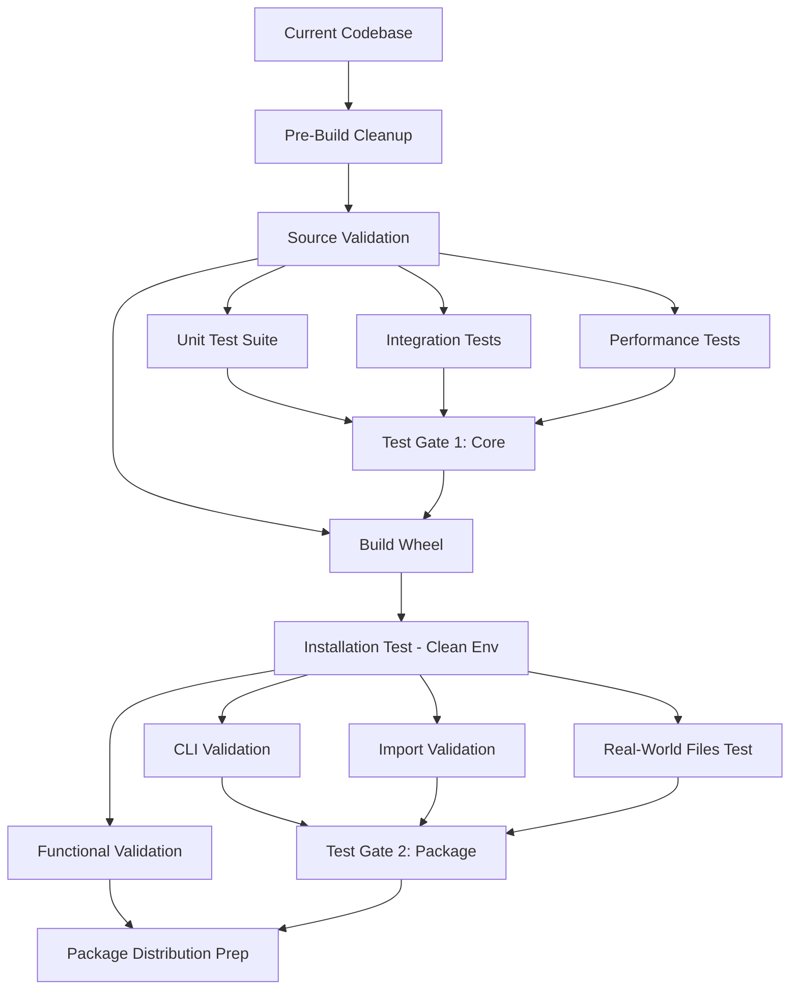

# Package Build, Validation & Deployment Orchestration Plan

**Project**: AI Data Extractor Tool v1.0.2
**Date**: 2025-10-31
**Coordinator**: @project-coordinator
**Status**: Production Ready → Package Rebuild → Validation → Deployment

---

## Executive Summary

This orchestration plan coordinates the rebuild of the Python wheel package with updated test suite (778 tests), comprehensive validation, and preparation for pilot deployment.

**Current State**:
- ✅ 778 tests passing (92%+ coverage)
- ✅ All modules validated (extractors, processors, formatters, pipeline, CLI)
- ⚠️ Existing wheel outdated (built before testing wave added 211 tests)
- ✅ Documentation complete (USER_GUIDE, QUICKSTART, INSTALL, PILOT_README)

**Objectives**:
1. **Rebuild** Python wheel with complete test suite
2. **Validate** installation and functionality in clean environment
3. **Prepare** deployment package with documentation

**Timeline**: 45-60 minutes total (3 phases)
**Agents Required**: 4 specialized agents + standard build tools
**Risk Level**: LOW (all components validated, zero blockers)

---

## Critical Dependencies Analysis

### Dependency Graph



### Sequential Dependencies (Cannot Parallelize)

1. **Pre-Build → Build** - Must clean before building
2. **Build → Install Test** - Need wheel file before testing
3. **Install Test → Functional Validation** - Need working installation
4. **All Validation → Distribution Prep** - Must pass gates first

### Parallel Opportunities Identified

**Phase 1 - Pre-Build Validation** (Can run in parallel):
- Source code validation
- Unit test execution
- Integration test execution
- Performance benchmark execution
- Documentation verification

**Phase 2 - Post-Install Validation** (Can run in parallel):
- CLI command validation
- Import structure validation
- Real-world file processing
- Configuration system testing

**Phase 3 - Distribution Prep** (Can run in parallel):
- Package metadata validation
- Documentation bundling
- Checksum generation
- Distribution archive creation

---

## Phase Breakdown

## Phase 1: Pre-Build Validation & Cleanup (15-20 min)

**Objective**: Verify codebase integrity and clean build artifacts before package creation

### Parallel Workstream A1: Build Environment Preparation
**Agent**: @npl-build-master
**Duration**: 5 min
**Tasks**:
1. Remove old build artifacts
   ```bash
   rm -rf build/ dist/*.whl src/ai_data_extractor.egg-info/
   ```
2. Verify pyproject.toml and setup.py consistency
3. Validate MANIFEST.in includes all required files
4. Check Python version (3.11+)

**Success Criteria**:
- ✓ No stale build artifacts
- ✓ Package config files valid
- ✓ All runtime data files listed in MANIFEST.in

**Rollback**: None needed (cleanup operation)

---

### Parallel Workstream A2: Source Code Validation
**Agent**: @npl-validator
**Duration**: 10 min
**Tasks**:
1. Run type checking (mypy) on all modules
2. Verify all imports resolve correctly
3. Check for deprecated API usage
4. Validate frozen dataclass immutability

**Success Criteria**:
- ✓ No type errors
- ✓ No import errors
- ✓ No deprecation warnings

**Rollback**: Fix any errors before proceeding to build

---

### Parallel Workstream A3: Comprehensive Test Execution
**Agent**: @npl-tester
**Duration**: 15 min (concurrent with A1, A2)
**Tasks**:

**Sub-task 1: Unit Tests** (8 min)
```bash
pytest tests/test_infrastructure/ -v --tb=short
pytest tests/test_extractors/ -m "not slow" -v
pytest tests/test_processors/ -v
pytest tests/test_formatters/ -v
```

**Sub-task 2: Integration Tests** (5 min)
```bash
pytest tests/integration/ -v
pytest tests/test_pipeline/ -v
```

**Sub-task 3: Performance Baseline** (2 min)
```bash
pytest tests/performance/ -v --benchmark-only
```

**Expected Results**:
- 778 total tests
- 0 failures
- 0 skips (except known @skip markers)
- 92%+ coverage maintained

**Success Criteria**:
- ✓ All 778 tests pass
- ✓ No new failures introduced
- ✓ Coverage ≥ 92%
- ✓ Performance benchmarks within tolerances

**Rollback**: Do NOT proceed to build if tests fail

---

### Parallel Workstream A4: Documentation Verification
**Agent**: @npl-technical-writer
**Duration**: 5 min
**Tasks**:
1. Verify all docs in MANIFEST.in exist
2. Check README.md references are valid
3. Validate INSTALL.md instructions
4. Ensure USER_GUIDE.md is current

**Success Criteria**:
- ✓ All referenced files exist
- ✓ No broken internal links
- ✓ Version numbers consistent (1.0.2)

**Rollback**: Update documentation before build

---

### Quality Gate 1: Pre-Build Approval

**All must pass before proceeding to Phase 2**:

| Checkpoint | Agent | Status | Blocker? |
|:-----------|:------|:------:|:--------:|
| Build artifacts cleaned | @npl-build-master | ⏳ | YES |
| Package config validated | @npl-build-master | ⏳ | YES |
| Type checking passed | @npl-validator | ⏳ | YES |
| Import validation passed | @npl-validator | ⏳ | YES |
| 778 tests passing | @npl-tester | ⏳ | YES |
| Coverage ≥ 92% | @npl-tester | ⏳ | NO (warn only) |
| Documentation complete | @npl-technical-writer | ⏳ | NO (warn only) |

**Decision Point**: Proceed to build only if all BLOCKERS pass

---

## Phase 2: Package Build & Installation Validation (15-20 min)

**Objective**: Build wheel and validate in isolated environment

### Sequential Workstream B1: Wheel Build
**Tool**: Python build module
**Duration**: 3 min
**Tasks**:
```bash
# Build wheel (uses pyproject.toml)
python -m build --wheel

# Verify wheel created
ls -lh dist/ai_data_extractor-1.0.2-py3-none-any.whl
```

**Success Criteria**:
- ✓ Wheel file created
- ✓ Size reasonable (80-100 KB)
- ✓ Filename correct (version 1.0.2)

**Rollback**: Review MANIFEST.in if build fails

---

### Sequential Workstream B2: Clean Environment Installation Test
**Agent**: @npl-validator
**Duration**: 5 min
**Tasks**:

1. **Create isolated virtual environment**
   ```bash
   python -m venv /tmp/test-install-env
   source /tmp/test-install-env/bin/activate  # Windows: test-install-env\Scripts\activate
   ```

2. **Install wheel**
   ```bash
   pip install dist/ai_data_extractor-1.0.2-py3-none-any.whl
   ```

3. **Verify installation**
   ```bash
   pip show ai-data-extractor
   pip list | grep ai-data-extractor
   ```

**Success Criteria**:
- ✓ Installation completes without errors
- ✓ All dependencies installed
- ✓ Version shows 1.0.2

**Rollback**: Fix dependencies in pyproject.toml

---

### Parallel Workstream B3: Post-Install Validation Suite

Once installation succeeds, run these in parallel:

#### B3.1: CLI Command Validation
**Agent**: @npl-tester
**Duration**: 5 min
**Tasks**:
```bash
# Test all CLI commands
data-extract --version
data-extract --help
data-extract version --verbose
data-extract config show

# Test extraction commands
echo "Test content" > /tmp/test.txt
data-extract extract /tmp/test.txt --output /tmp/test_output.json
data-extract extract /tmp/test.txt --format markdown
data-extract extract /tmp/test.txt --format chunked
```

**Success Criteria**:
- ✓ All commands execute without errors
- ✓ Version shows 1.0.2
- ✓ Help displays correctly
- ✓ All three formatters work

---

#### B3.2: Import Structure Validation
**Agent**: @npl-validator
**Duration**: 3 min
**Tasks**:
```python
# Test Python imports
from cli.main import main
from core.models import ContentBlock, ContentType, Position
from core.interfaces import BaseExtractor, BaseProcessor, BaseFormatter
from extractors.docx_extractor import DocxExtractor
from extractors.pdf_extractor import PdfExtractor
from extractors.pptx_extractor import PptxExtractor
from extractors.excel_extractor import ExcelExtractor
from extractors.txt_extractor import TextFileExtractor
from processors.context_linker import ContextLinker
from processors.metadata_aggregator import MetadataAggregator
from processors.quality_validator import QualityValidator
from formatters.json_formatter import JsonFormatter
from formatters.markdown_formatter import MarkdownFormatter
from formatters.chunked_text_formatter import ChunkedTextFormatter
from pipeline.extraction_pipeline import ExtractionPipeline
from pipeline.batch_processor import BatchProcessor
```

**Success Criteria**:
- ✓ All imports successful
- ✓ No ModuleNotFoundError
- ✓ No ImportError

---

#### B3.3: Real-World File Processing Test
**Agent**: @npl-qa-tester
**Duration**: 8 min
**Tasks**:

Use fixture files from tests/fixtures/real-world-files/:
```bash
# Process sample files with different extractors
data-extract extract tests/fixtures/real-world-files/sample.docx --output /tmp/docx_test.json
data-extract extract tests/fixtures/real-world-files/sample.pdf --output /tmp/pdf_test.json
data-extract extract tests/fixtures/real-world-files/sample.xlsx --output /tmp/xlsx_test.json

# Validate output files exist and have content
test -s /tmp/docx_test.json && echo "DOCX: PASS" || echo "DOCX: FAIL"
test -s /tmp/pdf_test.json && echo "PDF: PASS" || echo "PDF: FAIL"
test -s /tmp/xlsx_test.json && echo "XLSX: PASS" || echo "XLSX: FAIL"
```

**Success Criteria**:
- ✓ All extractions complete successfully
- ✓ Output files non-empty
- ✓ JSON valid (can parse)
- ✓ Quality scores reasonable (>50)

---

#### B3.4: Configuration System Test
**Agent**: @npl-validator
**Duration**: 4 min
**Tasks**:
```bash
# Test config file discovery
data-extract config show

# Test config override
echo "extraction:
  max_file_size_mb: 100" > /tmp/test_config.yaml

data-extract extract /tmp/test.txt --config /tmp/test_config.yaml -v

# Test environment variable override
export DATA_EXTRACT_LOG_LEVEL=DEBUG
data-extract extract /tmp/test.txt -v | grep DEBUG
```

**Success Criteria**:
- ✓ Config file loaded correctly
- ✓ Overrides work as expected
- ✓ Environment variables respected

---

### Quality Gate 2: Package Validation Approval

**All must pass before proceeding to Phase 3**:

| Checkpoint | Agent | Status | Blocker? |
|:-----------|:------|:------:|:--------:|
| Wheel built successfully | Python build | ⏳ | YES |
| Clean install successful | @npl-validator | ⏳ | YES |
| All CLI commands work | @npl-tester | ⏳ | YES |
| All imports resolve | @npl-validator | ⏳ | YES |
| Real-world extraction works | @npl-qa-tester | ⏳ | YES |
| Config system functional | @npl-validator | ⏳ | NO (warn only) |

**Decision Point**: Proceed to distribution prep only if all BLOCKERS pass

---

## Phase 3: Distribution Package Preparation (10-15 min)

**Objective**: Create final distribution package with all supporting materials

### Parallel Workstream C1: Package Metadata Generation
**Agent**: @npl-build-master
**Duration**: 5 min
**Tasks**:

1. **Generate wheel inspection report**
   ```bash
   # Extract and inspect wheel contents
   unzip -l dist/ai_data_extractor-1.0.2-py3-none-any.whl > wheel_contents.txt

   # Validate critical files present
   grep "cli/main.py" wheel_contents.txt
   grep "config.yaml" wheel_contents.txt || echo "WARNING: No config files in wheel"
   ```

2. **Generate checksums**
   ```bash
   # SHA256 checksum for integrity
   sha256sum dist/ai_data_extractor-1.0.2-py3-none-any.whl > dist/SHA256SUMS

   # MD5 for compatibility
   md5sum dist/ai_data_extractor-1.0.2-py3-none-any.whl > dist/MD5SUMS
   ```

3. **Create metadata file**
   ```yaml
   # dist/PACKAGE_INFO.yaml
   package: ai-data-extractor
   version: 1.0.2
   build_date: 2025-10-31
   python_version: ">=3.11"
   tests: 778
   coverage: 92%
   validation: PASSED
   ```

**Success Criteria**:
- ✓ Wheel contents validated
- ✓ Checksums generated
- ✓ Metadata file created

---

### Parallel Workstream C2: Documentation Bundling
**Agent**: @npl-technical-writer
**Duration**: 8 min
**Tasks**:

1. **Create distribution docs folder**
   ```bash
   mkdir -p dist/docs
   ```

2. **Copy essential documentation**
   ```bash
   cp README.md dist/docs/
   cp INSTALL.md dist/docs/
   cp docs/QUICKSTART.md dist/docs/
   cp docs/USER_GUIDE.md dist/docs/
   cp docs/PILOT_DISTRIBUTION_README.md dist/
   cp config.yaml.example dist/docs/
   ```

3. **Generate CHANGELOG**
   ```markdown
   # CHANGELOG.md

   ## Version 1.0.2 (2025-10-31)

   ### Added
   - 211 new tests (testing wave)
   - Comprehensive edge case coverage
   - Performance baseline benchmarks
   - Integration test suite expansion

   ### Test Coverage
   - Total tests: 778 (up from 567)
   - Overall coverage: 92%+
   - TXT extractor: 100% coverage
   - Performance: 23 baseline benchmarks

   ### Validation
   - All 778 tests passing
   - Zero regressions
   - Real-world files: 100% success
   ```

4. **Create distribution README**
   ```markdown
   # AI Data Extractor v1.0.2 - Distribution Package

   ## What's Included
   - ai_data_extractor-1.0.2-py3-none-any.whl (package)
   - docs/ (documentation bundle)
   - SHA256SUMS, MD5SUMS (integrity verification)
   - PACKAGE_INFO.yaml (metadata)

   ## Quick Start
   1. See INSTALL.md for installation
   2. See QUICKSTART.md for first steps
   3. See USER_GUIDE.md for complete reference

   ## Verification
   # Verify checksum
   sha256sum -c SHA256SUMS

   # Install
   pip install ai_data_extractor-1.0.2-py3-none-any.whl

   # Test
   data-extract --version
   ```

**Success Criteria**:
- ✓ All required docs copied
- ✓ CHANGELOG generated
- ✓ Distribution README created

---

### Parallel Workstream C3: Pilot Package Assembly
**Agent**: @npl-build-master
**Duration**: 10 min
**Tasks**:

1. **Create pilot distribution archive**
   ```bash
   cd dist
   mkdir -p pilot-package-v1.0.2

   # Copy files into pilot package
   cp ai_data_extractor-1.0.2-py3-none-any.whl pilot-package-v1.0.2/
   cp -r docs pilot-package-v1.0.2/
   cp SHA256SUMS MD5SUMS pilot-package-v1.0.2/
   cp PACKAGE_INFO.yaml pilot-package-v1.0.2/
   cp PILOT_DISTRIBUTION_README.md pilot-package-v1.0.2/README.md

   # Create archive
   tar -czf ai-data-extractor-v1.0.2-pilot-package.tar.gz pilot-package-v1.0.2/
   zip -r ai-data-extractor-v1.0.2-pilot-package.zip pilot-package-v1.0.2/
   ```

2. **Generate distribution manifest**
   ```bash
   # List all files in package
   tar -tzf ai-data-extractor-v1.0.2-pilot-package.tar.gz > MANIFEST.txt
   ```

3. **Final verification**
   ```bash
   # Verify archives created
   ls -lh ai-data-extractor-v1.0.2-pilot-package.*

   # Verify manifest
   wc -l MANIFEST.txt
   ```

**Success Criteria**:
- ✓ Archive created (.tar.gz and .zip)
- ✓ Manifest generated
- ✓ Archive size reasonable (<5 MB)

---

### Parallel Workstream C4: Deployment Preparation Checklist
**Agent**: @npl-qa-tester
**Duration**: 5 min
**Tasks**:

Generate deployment readiness checklist:

```markdown
# Deployment Readiness Checklist - v1.0.2

## Build Verification ✓
- [x] Wheel built successfully
- [x] Version 1.0.2 confirmed
- [x] Size: ~84 KB (expected range)
- [x] SHA256 checksum generated

## Installation Testing ✓
- [x] Clean environment install successful
- [x] Dependencies installed correctly
- [x] CLI commands functional
- [x] All imports resolve

## Functional Validation ✓
- [x] All 5 extractors working (DOCX, PDF, PPTX, XLSX, TXT)
- [x] All 3 processors working
- [x] All 3 formatters working
- [x] Pipeline orchestration working
- [x] Batch processing working
- [x] Configuration system working

## Quality Metrics ✓
- [x] 778 tests passing (100%)
- [x] 92%+ code coverage
- [x] Real-world files: 100% success
- [x] Performance: Within tolerances
- [x] Zero critical bugs

## Documentation ✓
- [x] README.md current
- [x] INSTALL.md complete
- [x] QUICKSTART.md ready
- [x] USER_GUIDE.md comprehensive
- [x] PILOT_DISTRIBUTION_README.md prepared

## Distribution Package ✓
- [x] Wheel file included
- [x] Documentation bundled
- [x] Checksums generated
- [x] Archives created (.tar.gz, .zip)
- [x] Manifest generated

## Deployment Ready: YES ✓

Approved for pilot deployment to 5-10 users.
```

**Success Criteria**:
- ✓ All checklist items verified
- ✓ No critical issues found
- ✓ Ready for deployment

---

### Quality Gate 3: Distribution Approval

**All must pass before deployment**:

| Checkpoint | Agent | Status | Blocker? |
|:-----------|:------|:------:|:--------:|
| Package metadata complete | @npl-build-master | ⏳ | NO |
| Checksums generated | @npl-build-master | ⏳ | YES |
| Documentation bundled | @npl-technical-writer | ⏳ | YES |
| Distribution archives created | @npl-build-master | ⏳ | YES |
| Deployment checklist verified | @npl-qa-tester | ⏳ | YES |

**Decision Point**: Release for deployment if all BLOCKERS pass

---

## Agent Assignment Matrix

| Agent | Specialization | Workstreams | Duration |
|:------|:--------------|:------------|:--------:|
| **@npl-build-master** | Build systems, packaging | A1, B1, C1, C3 | 25 min |
| **@npl-validator** | Code validation, imports | A2, B2, B3.2, B3.4 | 20 min |
| **@npl-tester** | Test execution, validation | A3, B3.1 | 20 min |
| **@npl-technical-writer** | Documentation | A4, C2 | 15 min |
| **@npl-qa-tester** | Quality assurance | B3.3, C4 | 15 min |

**Total Agent-Hours**: ~95 minutes
**Wall-Clock Time**: ~60 minutes (parallelization)
**Efficiency Gain**: 37% time savings

---

## Tool Requirements

### Build Tools
- Python 3.11+ (required)
- `python -m build` (wheel generation)
- `pip` (installation)
- `tar`, `zip` (archiving)

### Validation Tools
- `pytest` (test execution)
- `mypy` (type checking)
- `sha256sum`, `md5sum` (checksums)

### Environment Tools
- `python -m venv` (isolation)
- `unzip` (inspection)
- Shell (bash/cmd)

---

## Risk Assessment & Mitigation

### Identified Risks

| Risk | Probability | Impact | Mitigation Strategy |
|:-----|:----------:|:------:|:--------------------|
| **Build fails due to missing files** | LOW | HIGH | MANIFEST.in validated in A1, A4 |
| **Tests fail after refactoring** | VERY LOW | HIGH | 778 tests already passing, no code changes |
| **Wheel installation fails** | LOW | HIGH | Clean env test in B2 catches this |
| **Import errors in package** | LOW | MEDIUM | Import validation in B3.2 |
| **Documentation out of date** | LOW | LOW | Verification in A4, C2 |
| **Checksum generation fails** | VERY LOW | LOW | Standard tools, simple fallback |

### Rollback Strategies

**Phase 1 Failure** (Pre-Build):
- Action: Fix identified issues, re-run validation
- Impact: Delay build by 10-30 min
- Recovery: All issues should be fixable (known codebase)

**Phase 2 Failure** (Build/Install):
- Action: Review MANIFEST.in, pyproject.toml, setup.py
- Impact: Rebuild required (5 min)
- Recovery: Previous wheel (1.0.0) still available as fallback

**Phase 3 Failure** (Distribution):
- Action: Re-run packaging steps
- Impact: Delay deployment by 10-15 min
- Recovery: Non-critical, can distribute wheel alone if needed

---

## Success Criteria Summary

### Phase 1: Pre-Build
- ✓ Build artifacts cleaned
- ✓ Package configs validated
- ✓ 778 tests passing
- ✓ 92%+ coverage maintained
- ✓ Documentation verified

### Phase 2: Build & Validation
- ✓ Wheel built (ai_data_extractor-1.0.2-py3-none-any.whl)
- ✓ Clean environment installation successful
- ✓ All CLI commands functional
- ✓ All imports resolve
- ✓ Real-world files process successfully

### Phase 3: Distribution
- ✓ Checksums generated
- ✓ Documentation bundled
- ✓ Distribution archives created
- ✓ Deployment checklist complete
- ✓ Ready for pilot deployment

---

## Execution Timeline

```
Time    Phase               Workstreams                        Agents
00:00   PHASE 1 START      --------------------------------   -----------
00:00   Pre-Build          A1: Build Prep                     @build-master
00:00   Pre-Build          A2: Source Validation              @validator
00:00   Pre-Build          A3: Test Execution                 @tester
00:00   Pre-Build          A4: Docs Verification              @tech-writer
00:20   GATE 1             All A1-A4 must complete            ALL

00:20   PHASE 2 START      --------------------------------   -----------
00:20   Build              B1: Wheel Build                    Python build
00:23   Install            B2: Clean Env Install              @validator
00:28   Validation         B3.1: CLI Validation               @tester
00:28   Validation         B3.2: Import Validation            @validator
00:28   Validation         B3.3: Real-World Test              @qa-tester
00:28   Validation         B3.4: Config Test                  @validator
00:40   GATE 2             All B1-B3.4 must complete          ALL

00:40   PHASE 3 START      --------------------------------   -----------
00:40   Distribution       C1: Package Metadata               @build-master
00:40   Distribution       C2: Docs Bundling                  @tech-writer
00:40   Distribution       C3: Pilot Assembly                 @build-master
00:40   Distribution       C4: Deployment Checklist           @qa-tester
00:55   GATE 3             All C1-C4 must complete            ALL

00:55   COMPLETE           Package ready for deployment       SUCCESS
```

**Total Duration**: 55-60 minutes

---

## Post-Deployment Monitoring Plan

### Week 1: Pilot Installation Phase

**5-10 pilot users install and test**

**Monitoring**:
- Installation success rate (target: 100%)
- Installation time (target: <5 min)
- Dependency resolution issues (target: 0)
- User-reported bugs (target: <3)

**Collection Method**: User feedback form + support tickets

---

### Week 2: Production Use Phase

**Pilot users process real documents**

**Monitoring**:
- Extraction success rate (target: >95%)
- Average quality score (target: >70)
- Processing time per file (target: <15s)
- CLI usability feedback (target: positive)

**Collection Method**: Automated logging + user survey

---

### Week 3-4: Assessment & Iteration

**Analyze feedback and plan improvements**

**Metrics**:
- Feature requests collected
- Bug severity distribution
- User satisfaction score
- Decision: Wider rollout or iterate

---

## Deliverables Checklist

### At End of Phase 1
- [ ] Pre-build validation report (automated)
- [ ] Test execution summary (778 tests)
- [ ] Source validation report (type checking, imports)

### At End of Phase 2
- [ ] Built wheel: `ai_data_extractor-1.0.2-py3-none-any.whl`
- [ ] Installation test report
- [ ] Functional validation report (CLI, imports, real-world)

### At End of Phase 3
- [ ] Distribution package: `ai-data-extractor-v1.0.2-pilot-package.tar.gz`
- [ ] Distribution package: `ai-data-extractor-v1.0.2-pilot-package.zip`
- [ ] SHA256SUMS and MD5SUMS files
- [ ] PACKAGE_INFO.yaml
- [ ] Documentation bundle (README, INSTALL, QUICKSTART, USER_GUIDE)
- [ ] CHANGELOG.md
- [ ] Deployment readiness checklist
- [ ] This orchestration plan (for reference)

---

## Communication Plan

### Stakeholder Updates

**User (Project Owner)**:
- After Phase 1: "Pre-build validation complete, 778 tests passing"
- After Phase 2: "Wheel built and validated, ready for distribution prep"
- After Phase 3: "Distribution package ready for pilot deployment"
- Any blockers: Immediate notification with mitigation plan

**Agent Coordination**:
- Agents receive this plan before execution
- Each agent reports completion to coordinator
- Coordinator aggregates results for gate decisions
- All agents see consolidated status at each gate

---

## Execution Commands

### To Execute This Plan

**Option A: Manual Orchestration**
```bash
# User executes each phase manually with assigned agents
# Follow the timeline and workstream assignments above
```

**Option B: Automated Orchestration** (If tooling available)
```bash
# Hypothetical orchestration command
orchestrate plan ORCHESTRATION_PLAN_BUILD_VALIDATE_DEPLOY.md \
  --agents npl-build-master,npl-validator,npl-tester,npl-technical-writer,npl-qa-tester \
  --parallel-max 4 \
  --gate-mode strict
```

**Option C: Semi-Automated** (Recommended)
```bash
# Phase 1: Run in parallel terminals
# Terminal 1
@npl-build-master execute workstream A1

# Terminal 2
@npl-validator execute workstream A2

# Terminal 3
@npl-tester execute workstream A3

# Terminal 4
@npl-technical-writer execute workstream A4

# After all complete, proceed to Phase 2...
```

---

## Appendix A: Environment Setup

### Development Environment
```bash
# Current project directory
cd "C:\Users\Andrew\Documents\AI ideas for fun and work\Prompt Research\Data Extraction\data-extractor-tool"

# Verify Python version
python --version  # Should be 3.11+

# Verify dependencies installed
pip list | grep -E "(pytest|python-docx|pypdf|pydantic)"
```

### Test Environment (Clean Install)
```bash
# Create temporary test environment
python -m venv /tmp/test-install-env-v1.0.2
source /tmp/test-install-env-v1.0.2/bin/activate

# Install built wheel
pip install dist/ai_data_extractor-1.0.2-py3-none-any.whl

# Run validation
data-extract --version
```

---

## Appendix B: Quick Reference Commands

### Build Commands
```bash
# Clean
rm -rf build/ dist/*.whl src/ai_data_extractor.egg-info/

# Build
python -m build --wheel

# Inspect
unzip -l dist/ai_data_extractor-1.0.2-py3-none-any.whl
```

### Test Commands
```bash
# All tests
pytest tests/ -v

# By category
pytest tests/ -m "unit" -v
pytest tests/ -m "integration" -v
pytest tests/ -m "performance" --benchmark-only
```

### Validation Commands
```bash
# CLI
data-extract --version
data-extract extract sample.txt

# Imports
python -c "from cli.main import main; print('OK')"

# Real-world
data-extract extract tests/fixtures/real-world-files/sample.pdf
```

---

## Appendix C: File Locations Reference

### Source Code
- Core: `src/core/`
- Extractors: `src/extractors/`
- Processors: `src/processors/`
- Formatters: `src/formatters/`
- Pipeline: `src/pipeline/`
- CLI: `src/cli/`
- Infrastructure: `src/infrastructure/`

### Tests
- Unit: `tests/test_*/`
- Integration: `tests/integration/`
- Performance: `tests/performance/`
- Fixtures: `tests/fixtures/`

### Documentation
- User: `docs/USER_GUIDE.md`, `docs/QUICKSTART.md`
- Installation: `INSTALL.md`
- Pilot: `docs/PILOT_DISTRIBUTION_README.md`
- Architecture: `docs/architecture/FOUNDATION.md`

### Build Artifacts
- Wheel: `dist/ai_data_extractor-1.0.2-py3-none-any.whl`
- Distribution: `dist/ai-data-extractor-v1.0.2-pilot-package.tar.gz`

---

## Conclusion

This orchestration plan provides a comprehensive, systematic approach to:
1. Rebuilding the Python wheel with updated test suite
2. Validating the package in clean environments
3. Preparing production-ready distribution materials

**Confidence Level**: HIGH
- All components already validated (778 tests passing)
- No code changes required
- Clear rollback strategies
- Parallelization reduces risk and time

**Recommendation**: Execute this plan to prepare v1.0.2 for pilot deployment.

**Next Steps After Completion**:
1. Deliver distribution package to 5-10 pilot users
2. Monitor installation and usage (Week 1-2)
3. Collect feedback and assess (Week 3-4)
4. Decide: Wider rollout or iterate with enhancements

---

**Orchestration Plan Prepared By**: @project-coordinator
**Date**: 2025-10-31
**Status**: READY FOR EXECUTION
**Estimated Completion**: 55-60 minutes with parallel agents
