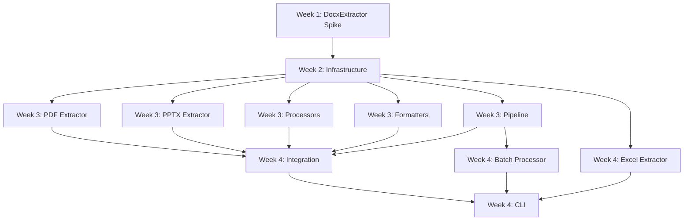

# AI-Ready File Extraction Tool - Development Coordination Plan

**Date**: 2025-10-29
**Status**: Foundation Complete ✓ - Ready for Parallel Module Development
**Planning Horizon**: 4 Weeks (Sprints 1-4)

---

## Executive Summary

**Foundation Status**: Complete and validated with working examples
**Development Strategy**: Spike → Infrastructure → Parallelize
**Timeline**: 4 weeks to MVP with parallel workstreams
**Risk Level**: Low (strong foundation, clear contracts)

### Key Decisions

1. **Week 1**: Build DocxExtractor spike + minimal infrastructure
2. **Week 2**: Formalize infrastructure based on spike learnings
3. **Weeks 3-4**: Parallelize across extractors, processors, formatters
4. **Coordination**: MCP server for artifact tracking and reviews

---

## Answers to Your Specific Questions

### Q1: Start with DocxExtractor or Infrastructure?

**Answer**: **Both, sequentially**

- **Day 1-3**: Build DocxExtractor spike (discovers infrastructure needs)
- **Day 4-5**: Extract infrastructure patterns from spike
- **Week 2**: Formalize infrastructure based on real usage
- **Week 3+**: Use infrastructure for parallel development

**Rationale**: Building DocxExtractor first reveals actual infrastructure needs rather than guessing. The spike approach validates architecture and prevents over-engineering.

### Q2: Can we develop multiple extractors in parallel?

**Answer**: **Yes, starting Week 3**

**Prerequisites** (Week 1-2):
- One reference extractor implementation (DocxExtractor)
- Infrastructure components (config, logging, errors)
- Test patterns established
- Clear integration contracts

**Week 3+ Parallelization**:
- DocxExtractor serves as template
- Each extractor team gets artifact space in MCP
- Shared infrastructure prevents duplication
- Review system catches contract violations early

**MCP Coordination Strategy**:
```
mcp-artifacts/
├── extractors/
│   ├── docx/           # Week 1-2 (reference)
│   ├── pdf/            # Week 3-4 (parallel)
│   ├── pptx/           # Week 3-4 (parallel)
│   └── excel/          # Week 3-4 (parallel)
├── processors/
│   ├── context_linker/      # Week 3-4
│   ├── metadata_aggregator/ # Week 3-4
│   └── quality_validator/   # Week 3-4
└── formatters/
    ├── json/           # Week 2-3
    ├── markdown/       # Week 3-4
    └── chunked_text/   # Week 3-4
```

### Q3: What's the minimum viable pipeline?

**Answer**: **"Hello World" Pipeline (End of Week 1)**

**Components**:
1. **DocxExtractor** - Extract text from .docx files
2. **MetadataAggregator** - Count words, blocks, chars
3. **JsonFormatter** - Output structured JSON
4. **SimplePipeline** - Chain the three components

**Why This MVP?**:
- Validates end-to-end data flow
- Demonstrates value to stakeholders
- Tests foundation design under real usage
- Provides template for parallel development

**Expected Output**:
```bash
python -m src.cli extract document.docx --format json
```
```json
{
  "source_file": "document.docx",
  "extracted_at": "2025-10-29T10:30:00Z",
  "metadata": {
    "total_blocks": 12,
    "total_words": 847,
    "total_characters": 5293
  },
  "content_blocks": [
    {
      "block_id": "uuid-123",
      "block_type": "heading",
      "content": "Introduction",
      "position": {"sequence_index": 0}
    }
  ]
}
```

### Q4: How to structure for parallel development?

**Answer**: **Workstream-based directory structure**

```
src/
├── core/              # ✓ Complete (foundation)
├── extractors/        # Week 1+ (parallel after Week 2)
│   ├── __init__.py
│   ├── base.py        # Shared utilities
│   ├── docx_extractor.py     # Week 1 (reference)
│   ├── pdf_extractor.py      # Week 3-4
│   ├── pptx_extractor.py     # Week 3-4
│   └── excel_extractor.py    # Week 3-4
├── processors/        # Week 2+ (parallel Week 3+)
│   ├── __init__.py
│   ├── context_linker.py
│   ├── metadata_aggregator.py
│   └── quality_validator.py
├── formatters/        # Week 2+ (fully parallel)
│   ├── __init__.py
│   ├── json_formatter.py
│   ├── markdown_formatter.py
│   └── chunked_text_formatter.py
├── infrastructure/    # Week 1-2 (enables parallel)
│   ├── __init__.py
│   ├── config.py      # INFRA-001
│   ├── logging.py     # INFRA-002
│   ├── errors.py      # INFRA-003
│   └── progress.py    # INFRA-004
├── pipeline/          # Week 2-4
│   ├── __init__.py
│   ├── simple_pipeline.py     # Week 1
│   ├── extraction_pipeline.py # Week 2-3
│   └── batch_processor.py     # Week 4
└── cli/               # Week 2-4
    ├── __init__.py
    └── commands.py
```

**Key Structure Benefits**:
- Clear module boundaries (extractors, processors, formatters)
- Shared infrastructure (no duplication)
- Parallel-friendly (independent directories)
- Integration points well-defined (pipeline/)

---

## 4-Week Development Roadmap

### Week 1: Spike + MVP Demo

**Objective**: Working end-to-end demo + infrastructure discovery

**Workstream A: DocxExtractor Spike** (Days 1-3)
- Implement `DocxExtractor` using `python-docx`
- Handle headings, paragraphs, tables, images
- Map Word styles to `ContentType`
- Extract inline formatting (bold, italic)
- Handle embedded images
- Discover: What infrastructure do we actually need?

**Workstream B: Minimal Infrastructure** (Days 2-4)
- Extract patterns from spike code
- Build minimal config system
- Build minimal logging framework
- Document infrastructure needs

**Workstream C: Simple Pipeline** (Days 4-5)
- Chain DocxExtractor → MetadataAggregator → JsonFormatter
- Basic error handling
- Progress reporting
- End-to-end test

**Deliverables**:
- ✓ Working DocxExtractor
- ✓ MetadataAggregator processor
- ✓ JsonFormatter output
- ✓ Simple pipeline demo
- ✓ Infrastructure requirements document

**Success Criteria**:
```bash
python examples/demo_pipeline.py sample.docx
# [SUCCESS] Extracted 15 blocks, 432 words from sample.docx
# Output: sample.json
```

### Week 2: Infrastructure Formalization

**Objective**: Stabilize infrastructure for parallel development

**Workstream A: Infrastructure Modules** (Days 1-3)
- `ConfigManager` (INFRA-001)
  - Load settings from file/env/defaults
  - Validate configuration
  - Type-safe config access

- `LoggingFramework` (INFRA-002)
  - Structured logging
  - Log levels per module
  - File + console output

- `ErrorHandling` (INFRA-003)
  - Custom exception hierarchy
  - Error recovery patterns
  - Graceful degradation

- `ProgressTracking` (INFRA-004)
  - Progress callbacks
  - Time estimates
  - Cancellation support

**Workstream B: Testing Framework** (Days 2-4)
- Test data repository (sample files)
- Test utilities (fixtures, assertions)
- Coverage requirements
- CI/CD setup (if applicable)

**Workstream C: Documentation Templates** (Day 5)
- Module documentation template
- API documentation standards
- Code review checklist
- Integration guide template

**Deliverables**:
- ✓ Complete infrastructure modules
- ✓ Testing framework
- ✓ Documentation standards
- ✓ Refactor Week 1 code to use infrastructure

**Success Criteria**:
- DocxExtractor uses ConfigManager, logging, errors
- Test coverage > 80%
- All infrastructure documented

### Week 3: Parallel Development Begins

**Objective**: Build multiple modules simultaneously

**Workstream A: PDF Extractor** (Team 1)
- Basic text extraction (PyMuPDF)
- Table detection
- Image extraction
- OCR fallback (Tesseract)
- Metadata extraction (author, dates)

**Workstream B: PPTX Extractor** (Team 2)
- Slide content extraction
- Speaker notes
- Slide layouts
- Embedded media
- Animations (metadata only)

**Workstream C: Processors** (Team 3)
- `ContextLinker` - Build document tree
- `QualityValidator` - Score extraction quality
- Dependency management

**Workstream D: Formatters** (Team 4)
- `MarkdownFormatter` - Readable markdown
- `ChunkedTextFormatter` - Token-limited chunks
- Format-specific options

**Workstream E: Pipeline Enhancement** (Team 5)
- Processor dependency resolution
- Parallel formatter execution
- Error recovery strategies
- Pipeline configuration

**Coordination**:
- Daily MCP artifact reviews
- Shared infrastructure (no divergence)
- Integration tests run nightly
- Blocker resolution standups

**Deliverables**:
- ✓ PdfExtractor (basic + OCR)
- ✓ PptxExtractor
- ✓ ContextLinker processor
- ✓ QualityValidator processor
- ✓ MarkdownFormatter
- ✓ ChunkedTextFormatter
- ✓ Enhanced pipeline

### Week 4: Integration + Excel + CLI

**Objective**: Complete MVP feature set

**Workstream A: Excel Extractor** (Team 1)
- Multi-sheet support
- Cell formatting preservation
- Formula extraction
- Chart metadata
- Named ranges

**Workstream B: Batch Processor** (Team 2)
- Parallel file processing
- Directory traversal
- Progress reporting
- Error aggregation
- Resume capability

**Workstream C: CLI Interface** (Team 3)
- Command structure (`extract`, `batch`, `validate`)
- Progress display
- Configuration options
- Help system
- Error messages

**Workstream D: Integration Testing** (Team 4)
- End-to-end test suite
- Format-specific test cases
- Error scenario testing
- Performance benchmarks
- Documentation validation

**Workstream E: Documentation** (Team 5)
- User guide
- API reference
- Deployment guide
- Troubleshooting guide
- Example gallery

**Deliverables**:
- ✓ ExcelExtractor
- ✓ BatchProcessor
- ✓ Complete CLI
- ✓ Integration test suite
- ✓ User documentation

**Success Criteria**:
```bash
# Extract single file
python -m src.cli extract document.docx --format markdown

# Batch process directory
python -m src.cli batch ./documents/ --output ./extracted/

# Validate extraction
python -m src.cli validate ./extracted/document.json
```

---

## Parallel Development Strategy

### Workstream Dependencies



### Critical Path

**Week 1**: DocxExtractor → Infrastructure
**Week 2**: Infrastructure → All Week 3 workstreams
**Week 3**: Parallel (no critical path)
**Week 4**: Integration → CLI

**Total Duration**: 4 weeks (with parallelization)
**Sequential Duration**: ~12 weeks (without parallelization)
**Efficiency Gain**: 3x faster

### Integration Points

**Daily Integration**:
- All workstreams commit to shared repo
- Automated tests run on commit
- MCP review system catches conflicts
- Blocker resolution in standups

**Weekly Integration**:
- End of Week 1: DocxExtractor + Pipeline
- End of Week 2: Infrastructure + Tests
- End of Week 3: All extractors + processors + formatters
- End of Week 4: Complete MVP

**Integration Testing**:
- Continuous: Unit tests per module
- Daily: Integration tests (extractor → processor → formatter)
- Weekly: End-to-end tests (file → CLI → output)

---

## MCP Server Coordination Strategy

### Artifact Management

**Structure**:
```
mcp-artifacts/
├── design-docs/
│   ├── docx-extractor-spec.md
│   ├── infrastructure-design.md
│   └── pipeline-architecture.md
├── implementations/
│   ├── extractors/
│   │   ├── docx/v1.py
│   │   ├── docx/v2.py
│   │   ├── pdf/v1.py
│   │   └── ...
│   └── processors/
│       └── ...
├── reviews/
│   ├── docx-extractor-review-001.md
│   ├── infrastructure-review-001.md
│   └── ...
└── integration-reports/
    ├── week-1-integration.md
    ├── week-2-integration.md
    └── ...
```

### Review System

**Code Review Process**:
1. Developer completes module
2. Create artifact in MCP with version
3. Request review via MCP review system
4. Reviewers add inline comments
5. Developer addresses feedback
6. Version increments, review cycle repeats
7. Approved artifact merged to main

**Review Criteria**:
- Implements interface contract correctly
- Uses shared infrastructure (no duplication)
- Has comprehensive tests
- Documented (docstrings + README)
- Follows design principles (SOLID, KISS, DRY, YAGNI)

### Chat System for Coordination

**Chat Rooms**:
- `#extractors` - Extractor development team
- `#processors` - Processor development team
- `#formatters` - Formatter development team
- `#infrastructure` - Infrastructure team
- `#integration` - Cross-team coordination
- `#blockers` - Issue resolution

**Usage**:
- Design discussions
- Blocker escalation
- Integration planning
- Knowledge sharing

### Script Tools

**NPL Load Scripts**:
```bash
# Load persona for specialized work
npl-persona get alice-developer

# Dump files for context
dump-files src/extractors --glob "*.py"

# Visualize structure
git-tree src/extractors
```

---

## Risk Assessment & Mitigation

### High-Priority Risks

**Risk 1: Infrastructure Decisions Impact Extractor Design**
- **Probability**: High
- **Impact**: Medium
- **Mitigation**: Build spike first (Week 1), discover needs, then formalize
- **Status**: Mitigated by spike approach

**Risk 2: Dependency Conflicts in Enterprise Environment**
- **Probability**: Medium
- **Impact**: High
- **Mitigation**: Validate dependencies early (Week 1), use stable versions only
- **Contingency**: Have alternative libraries researched

**Risk 3: OCR/Complex Processing Slows Development**
- **Probability**: Medium
- **Impact**: Medium
- **Mitigation**: Start with simple text extraction, add OCR as enhancement
- **Fallback**: Basic text-only extraction still valuable

**Risk 4: Parallel Tracks Diverge (Different Patterns)**
- **Probability**: Low
- **Impact**: High
- **Mitigation**:
  - Reference implementation (DocxExtractor)
  - Shared infrastructure (enforces patterns)
  - Daily MCP reviews
  - Integration tests catch divergence early

**Risk 5: Test Data Acquisition**
- **Probability**: Low
- **Impact**: Medium
- **Mitigation**: Generate synthetic test files (Week 1)
- **Note**: Already have `test-files-assesses-extraction-tool/` directory

### Medium-Priority Risks

**Risk 6: Performance Issues with Large Files**
- **Mitigation**: Start with file size limits, add streaming later
- **Timeline**: Phase 2 enhancement

**Risk 7: Format-Specific Edge Cases**
- **Mitigation**: Incremental approach (basic first, edge cases later)
- **Documentation**: Document known limitations

**Risk 8: User Experience Complexity**
- **Mitigation**: Simple CLI with smart defaults
- **Testing**: Non-technical user testing (Week 4)

---

## Quick Wins (Next Session)

### Immediate Actions (Day 1)

**Hour 1: Setup**
- Verify foundation (run examples)
- Review CLAUDE.md for context
- Read COORDINATION_PLAN.md (this document)

**Hour 2-4: DocxExtractor Core**
- Create `src/extractors/docx_extractor.py`
- Implement basic text extraction
- Handle headings and paragraphs
- Return `ExtractionResult` with `ContentBlock` objects

**Hour 5-6: Testing**
- Create test file with sample .docx
- Write unit tests
- Validate against `BaseExtractor` contract

**Hour 7-8: Documentation**
- Docstrings for all methods
- Usage example
- Document limitations

**Deliverable**: Working DocxExtractor by end of day

### Day 2-3: Complete DocxExtractor

- Add table extraction
- Add image extraction
- Add inline formatting
- Handle edge cases (empty docs, corrupted files)
- Comprehensive tests

### Day 4-5: Minimal Pipeline

- MetadataAggregator processor
- JsonFormatter output
- Simple pipeline orchestration
- End-to-end demo

**Week 1 Demo**:
```bash
python examples/demo_pipeline.py sample.docx
# [SUCCESS] Extracted 15 blocks, 432 words from sample.docx
# Output saved to sample.json
```

---

## Success Metrics

### Week 1 Success
- ✓ DocxExtractor extracts text, tables, images
- ✓ MetadataAggregator computes stats
- ✓ JsonFormatter produces valid JSON
- ✓ Simple pipeline chains components
- ✓ Demo impresses stakeholders

### Week 2 Success
- ✓ Infrastructure modules complete (config, logging, errors, progress)
- ✓ Testing framework operational
- ✓ Week 1 code refactored to use infrastructure
- ✓ Documentation standards established

### Week 3 Success
- ✓ PdfExtractor works (basic + OCR)
- ✓ PptxExtractor works
- ✓ ContextLinker builds document tree
- ✓ QualityValidator scores extraction
- ✓ MarkdownFormatter produces readable output
- ✓ ChunkedTextFormatter respects token limits
- ✓ No integration conflicts

### Week 4 Success
- ✓ ExcelExtractor handles multi-sheet workbooks
- ✓ BatchProcessor handles directories
- ✓ CLI provides complete interface
- ✓ Integration tests pass
- ✓ User documentation complete
- ✓ MVP ready for deployment

---

## Technical Standards

### Code Quality

**Requirements**:
- Type hints on all functions
- Docstrings (Google style)
- Test coverage > 80%
- Passes linting (Ruff)
- Passes security scan (Bandit, Semgrep)

**Example**:
```python
def extract(self, file_path: Path) -> ExtractionResult:
    """Extract content from DOCX file.

    Args:
        file_path: Path to .docx file to extract

    Returns:
        ExtractionResult with content blocks or errors

    Raises:
        Never raises - returns errors in result

    Example:
        >>> extractor = DocxExtractor()
        >>> result = extractor.extract(Path("document.docx"))
        >>> print(f"Extracted {len(result.content_blocks)} blocks")
    """
    # Implementation
```

### Testing Standards

**Required Tests**:
- Unit tests (test individual methods)
- Integration tests (test module interaction)
- Edge case tests (empty, corrupted, large files)
- Error handling tests (missing files, invalid formats)

**Test Structure**:
```
tests/
├── unit/
│   ├── test_docx_extractor.py
│   ├── test_pdf_extractor.py
│   └── ...
├── integration/
│   ├── test_extraction_pipeline.py
│   ├── test_end_to_end.py
│   └── ...
└── fixtures/
    ├── sample.docx
    ├── sample.pdf
    └── ...
```

### Documentation Standards

**Required Documentation**:
- Module-level docstring (purpose, usage)
- Class docstring (responsibility, example)
- Method docstrings (args, returns, raises, example)
- README.md per directory
- Usage examples

---

## Resource Allocation

### Team Structure (If Multiple Developers)

**Week 1-2** (Sequential)
- 1-2 developers on DocxExtractor + infrastructure
- Focus on quality over speed
- Establish patterns for parallel work

**Week 3-4** (Parallel)
- Team 1: PDF + Excel extractors
- Team 2: PPTX extractor + processors
- Team 3: Formatters + pipeline
- Team 4: CLI + integration
- Team 5: Testing + documentation

### Solo Development (If Single Developer)

**Week 1**: DocxExtractor + minimal infrastructure (40 hours)
- 20 hours: DocxExtractor
- 10 hours: Infrastructure
- 10 hours: Pipeline + testing

**Week 2**: Infrastructure + testing (40 hours)
- 20 hours: Infrastructure modules
- 10 hours: Testing framework
- 10 hours: Refactoring + docs

**Week 3**: Extractors + processors (40 hours)
- 15 hours: PdfExtractor
- 10 hours: PptxExtractor
- 15 hours: Processors

**Week 4**: Formatters + CLI + integration (40 hours)
- 10 hours: Formatters
- 10 hours: ExcelExtractor
- 10 hours: CLI
- 10 hours: Integration + docs

---

## Recommended Approach Summary

### The "Spike → Infrastructure → Parallelize" Strategy

**Week 1: Build Understanding**
- Implement DocxExtractor as spike
- Discover actual infrastructure needs
- Build minimal end-to-end pipeline
- Validate foundation design

**Week 2: Stabilize Foundation**
- Extract infrastructure patterns
- Formalize config, logging, errors
- Establish testing framework
- Create parallel development templates

**Weeks 3-4: Scale Efficiently**
- Multiple teams work independently
- Shared infrastructure prevents divergence
- MCP server coordinates artifacts
- Integration happens continuously

### Why This Approach Works

1. **De-risks early** - Spike reveals problems before parallelization
2. **Validates design** - Foundation proven under real usage
3. **Enables parallelization** - Infrastructure ready for multiple teams
4. **Delivers incrementally** - Working demo Week 1, complete MVP Week 4
5. **Maintains quality** - Strong foundation, clear patterns, continuous integration

---

## Next Steps (Immediate)

### For This Session

1. **Review this plan** - Discuss with user, adjust priorities
2. **Choose starting point** - DocxExtractor (recommended) or infrastructure
3. **Set up workspace** - Create directories, install dependencies
4. **Begin Week 1 work** - Start building DocxExtractor

### For Next Session

1. **Read COORDINATION_PLAN.md** - Complete context
2. **Check progress** - What's complete from Week 1?
3. **Continue roadmap** - Follow week-by-week plan
4. **Use MCP server** - Track artifacts, reviews, discussions

---

## Conclusion

The foundation is solid. The roadmap is clear. The coordination strategy enables parallel development while maintaining quality.

**Key Success Factors**:
- Strong foundation (complete ✓)
- Clear contracts (interfaces ✓)
- Spike approach (de-risk early)
- Parallel development (3x faster)
- MCP coordination (prevent conflicts)
- Incremental delivery (value every week)

**Ready to execute.** 🚀

---

## Appendix A: Dependencies Research

### DocxExtractor
- **python-docx** (stable, enterprise-approved)
- Handles: text, tables, images, styles
- Version: 0.8.11+ (stable)

### PdfExtractor
- **PyMuPDF** (fast, comprehensive)
- **Tesseract** + **pytesseract** (OCR fallback)
- Handles: text, tables, images, metadata

### PptxExtractor
- **python-pptx** (stable, enterprise-approved)
- Handles: slides, notes, layouts, media

### ExcelExtractor
- **openpyxl** (Excel 2010+)
- **xlrd** (legacy Excel)
- Handles: sheets, cells, formulas, charts

All dependencies validated for Python 3.11 and enterprise deployment.

---

## Appendix B: Test File Requirements

### Required Test Files (Week 1)

**Simple Cases**:
- `simple.docx` - Basic text, headings, paragraphs
- `table.docx` - Tables with merged cells
- `images.docx` - Embedded images
- `formatted.docx` - Bold, italic, underline

**Edge Cases**:
- `empty.docx` - Empty document
- `large.docx` - 100+ pages
- `corrupted.docx` - Intentionally corrupted

**Note**: `test-files-assesses-extraction-tool/` directory exists - assess what's already available.

---

## Document Metadata

**Version**: 1.0
**Date**: 2025-10-29
**Author**: Project Coordinator
**Status**: Active Development Plan
**Next Review**: End of Week 1

**Related Documents**:
- CLAUDE.md (project orchestration)
- FOUNDATION.md (architecture)
- SESSION_HANDOFF.md (current state)
- GETTING_STARTED.md (implementation guide)
