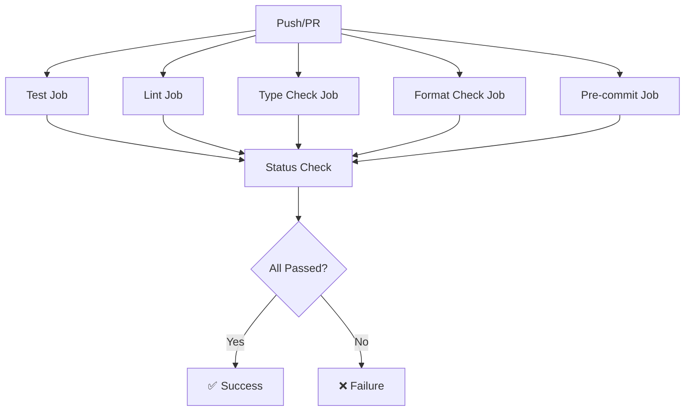

# CI/CD Infrastructure Analysis

## Summary
- Files scanned: 4 CI/CD configuration files
- Key findings:
  - Comprehensive 5-stage quality gate pipeline (test, lint, type-check, format, pre-commit)
  - Performance testing with regression detection (10% threshold)
  - spaCy model caching for faster CI builds
  - Pre-commit hooks enforce quality standards locally
  - Coverage threshold: 60% (enforced in CI)
  - Multi-Python version testing (3.12, 3.13)

## Detailed Analysis

### CI/CD Pipeline Overview

**Total Workflows**: 3 GitHub Actions workflows

1. **test.yml** - Test & Quality Checks (runs on every push/PR)
2. **performance.yml** - Weekly Performance Tests (Monday 2am UTC)
3. **performance-regression.yml** - Performance Regression Detection (main branch, weekly, manual)

**Additional**: Pre-commit configuration for local development quality gates

### Main CI Pipeline (test.yml)

**Triggers**:
- Push to: `main`, `develop`, `feature/**` branches
- Pull requests to: `main`, `develop`

**Pipeline Architecture**: 6 parallel jobs + final status check



#### Job 1: Tests & Coverage

**Platform**: ubuntu-latest
**Python Versions**: 3.12, 3.13 (matrix strategy)
**Duration**: ~5-10 minutes

**Steps** (11 steps):

1. **Checkout code** (`actions/checkout@v4`)

2. **Set up Python** (`actions/setup-python@v5`)
   - Python 3.12 and 3.13 (matrix)

3. **Cache dependencies** (`actions/cache@v4`)
   - Path: `~/.cache/pip`
   - Key: `${{ runner.os }}-pip-${{ hashFiles('pyproject.toml') }}`
   - Speeds up builds by caching pip packages

4. **Cache spaCy models** (`actions/cache@v4`)
   - Path: `~/.cache/spacy`
   - Key: `${{ runner.os }}-spacy-3.7.2-en_core_web_md`
   - Critical for performance (43MB model, ~1.2s load time)

5. **Install dependencies**
   ```bash
   python -m pip install --upgrade pip
   pip install -e ".[dev]"
   python -m spacy download en_core_web_md
   ```

6. **Run unit tests**
   ```bash
   pytest -m unit --cov=src --cov-report=term --cov-report=xml -v
   ```

7. **Run integration tests**
   ```bash
   pytest -m integration --cov=src --cov-append --cov-report=term --cov-report=xml -v
   ```

8. **Run remaining tests**
   ```bash
   pytest -m "not unit and not integration" --cov=src --cov-append \
     --cov-report=term --cov-report=xml --cov-report=html \
     --ignore=tests/performance/test_cli_benchmarks.py -v
   ```
   - Excludes `test_cli_benchmarks.py` (run in performance workflow)

9. **Validate coverage threshold**
   ```bash
   coverage report --fail-under=60 || {
     echo "❌ Coverage below 60% threshold"
     echo "Current coverage: $(coverage report | grep TOTAL | awk '{print $4}')"
     echo "Review coverage report in artifacts for details"
     exit 1
   }
   ```
   - **Hard threshold**: 60% minimum coverage
   - Fails build if coverage drops below threshold

10. **Upload coverage to Codecov** (`codecov/codecov-action@v4`)
    - Uploads coverage.xml
    - Flags: unittests
    - Name: codecov-3.12 / codecov-3.13
    - Fail on error: false (optional integration)

11. **Upload coverage HTML artifact** (`actions/upload-artifact@v4`)
    - Only for Python 3.12 (avoid duplication)
    - Artifact: coverage-report
    - Path: htmlcov/
    - Retention: Default (90 days)

**Test Execution Strategy**:
- **3-phase test execution**: unit → integration → remaining
- **Coverage accumulation**: `--cov-append` preserves coverage across phases
- **Selective execution**: Marker-based test filtering
- **Performance isolation**: CLI benchmarks excluded (run separately)

#### Job 2: Linting (Ruff)

**Platform**: ubuntu-latest
**Python Version**: 3.12
**Duration**: ~1-2 minutes

**Steps** (4 steps):

1. **Checkout code**
2. **Set up Python 3.12**
3. **Install ruff**
   ```bash
   python -m pip install --upgrade pip
   pip install ruff~=0.6.0
   ```
4. **Run ruff linter**
   ```bash
   ruff check src/ tests/ --output-format=github
   ```
   - `--output-format=github`: Annotates PR with linting errors
   - Checks: E, F, I, N, W (see pyproject.toml)
   - Ignores: E501 (line too long, handled by black)

**Ruff Configuration** (from pyproject.toml):
```toml
[tool.ruff]
line-length = 100
target-version = "py312"

[tool.ruff.lint]
select = ["E", "F", "I", "N", "W"]
ignore = ["E501"]
```

**Checked Rules**:
- **E**: pycodestyle errors (PEP 8)
- **F**: Pyflakes (undefined names, unused imports)
- **I**: isort (import sorting)
- **N**: pep8-naming (naming conventions)
- **W**: pycodestyle warnings

#### Job 3: Type Checking (Mypy)

**Platform**: ubuntu-latest
**Python Version**: 3.12
**Duration**: ~1-2 minutes

**Steps** (4 steps):

1. **Checkout code**
2. **Set up Python 3.12**
3. **Install dependencies**
   ```bash
   python -m pip install --upgrade pip
   pip install mypy~=1.11.0 pydantic>=2.0.0 types-PyYAML
   ```
   - Minimal install (mypy + type stubs only)

4. **Run mypy type checker**
   ```bash
   mypy src/data_extract/ --python-version=3.12
   ```
   - **Only checks greenfield**: `src/data_extract/`
   - **Excludes brownfield**: `src/(cli|extractors|processors|formatters|core|pipeline|infrastructure)/`
   - Strict mode enabled (see pyproject.toml)

**Mypy Configuration** (from pyproject.toml):
```toml
[tool.mypy]
python_version = "3.12"
warn_return_any = true
warn_unused_configs = true
disallow_untyped_defs = true
explicit_package_bases = true
exclude = [
    "src/(cli|extractors|processors|formatters|core|pipeline|infrastructure)/",
]
```

**Strict Checks Enabled**:
- `warn_return_any`: Warn if function returns Any
- `warn_unused_configs`: Warn about unused mypy config
- `disallow_untyped_defs`: Require type hints on all functions
- `explicit_package_bases`: Use explicit package structure

#### Job 4: Format Checking (Black)

**Platform**: ubuntu-latest
**Python Version**: 3.12
**Duration**: ~1 minute

**Steps** (4 steps):

1. **Checkout code**
2. **Set up Python 3.12**
3. **Install black**
   ```bash
   python -m pip install --upgrade pip
   pip install black~=24.0
   ```
4. **Run black format check**
   ```bash
   black --check --line-length=100 src/ tests/
   ```
   - `--check`: Verify formatting without modifying files
   - Fails if any file would be reformatted

**Black Configuration** (from pyproject.toml):
```toml
[tool.black]
line-length = 100
target-version = ['py312']
include = '\.pyi?$'
```

#### Job 5: Pre-commit Hooks Validation

**Platform**: ubuntu-latest
**Python Version**: 3.12
**Duration**: ~2-3 minutes

**Steps** (4 steps):

1. **Checkout code**
2. **Set up Python 3.12**
3. **Install pre-commit**
   ```bash
   python -m pip install --upgrade pip
   pip install pre-commit
   ```
4. **Run pre-commit on all files**
   ```bash
   pre-commit run --all-files
   ```

**Pre-commit Hooks** (from .pre-commit-config.yaml):
```yaml
repos:
  - repo: https://github.com/pre-commit/pre-commit-hooks
    rev: v4.5.0
    hooks:
      - id: trailing-whitespace
      - id: end-of-file-fixer
      - id: check-yaml
      - id: check-added-large-files
      - id: check-merge-conflict
      - id: mixed-line-ending

  - repo: https://github.com/psf/black
    rev: 24.1.0
    hooks:
      - id: black
        args: [--line-length=100]

  - repo: https://github.com/astral-sh/ruff-pre-commit
    rev: v0.6.0
    hooks:
      - id: ruff
        args: [--fix]

  - repo: https://github.com/pre-commit/mirrors-mypy
    rev: v1.11.0
    hooks:
      - id: mypy
        files: ^src/data_extract/
        additional_dependencies: [pydantic>=2.0.0, types-PyYAML]
```

**Hook Categories**:
1. **File Quality** (6 hooks):
   - trailing-whitespace, end-of-file-fixer
   - check-yaml, check-added-large-files
   - check-merge-conflict, mixed-line-ending

2. **Code Formatting** (1 hook):
   - black (with --line-length=100)

3. **Linting** (1 hook):
   - ruff (with --fix for auto-correction)

4. **Type Checking** (1 hook):
   - mypy (only for src/data_extract/)

**Pre-commit Enforcement**:
- ✅ Runs locally on `git commit`
- ✅ Runs in CI on every push/PR
- ✅ Ensures consistency between local and CI environments

#### Job 6: All Checks Passed (Status Check)

**Platform**: ubuntu-latest
**Dependencies**: All 5 jobs above
**Condition**: `if: always()` (runs even if others fail)

**Steps** (1 step):

**Check all jobs status**:
```bash
if [ "${{ needs.test.result }}" != "success" ] || \
   [ "${{ needs.lint.result }}" != "success" ] || \
   [ "${{ needs.type-check.result }}" != "success" ] || \
   [ "${{ needs.format-check.result }}" != "success" ] || \
   [ "${{ needs.pre-commit.result }}" != "success" ]; then
  echo "❌ One or more quality checks failed"
  exit 1
else
  echo "✅ All quality checks passed"
fi
```

**Purpose**: Single status check for branch protection rules

### Performance Testing Pipeline (performance.yml)

**Triggers**:
- Schedule: Monday at 2:00 AM UTC (weekly) - `cron: '0 2 * * 1'`
- Manual: `workflow_dispatch` with verbose option

**Platform**: ubuntu-latest
**Timeout**: 30 minutes

**Jobs**: 2 jobs (performance-tests, performance-summary)

#### Job 1: Performance Validation

**Steps** (6 steps):

1. **Checkout code**
2. **Set up Python 3.12**
3. **Cache dependencies** (pip + spaCy)
4. **Install dependencies**
   ```bash
   python -m pip install --upgrade pip
   pip install -e ".[dev]"
   ```
5. **Create 100-file performance batch**
   ```bash
   python -m scripts.create_performance_batch
   ```
   - Generates 100 mixed-format files
   - Output: `tests/performance/batch_100_files/`

6. **Run performance tests**
   ```bash
   pytest -m performance tests/performance/test_throughput.py \
     -v --tb=short --no-cov \
     ${{ github.event.inputs.verbose == 'true' && '-s' || '' }}
   ```
   - Marker: `-m performance`
   - Specific test: `test_throughput.py`
   - No coverage: `--no-cov` (performance focus)
   - Verbose mode: Optional `-s` flag

7. **Upload performance results**
   - Artifact: `performance-results-${{ github.run_number }}`
   - Retention: 90 days
   - Excludes: batch files, pycache

**NFR Validation**:
- **NFR-P1**: 100 files in <10 minutes (baseline: 6.86 min)
- **NFR-P2**: Peak memory <2GB (baseline: 4.15GB, documented trade-off)
- **Memory Leak Detection**: <10% growth over iterations

#### Job 2: Performance Summary

**Dependencies**: performance-tests
**Condition**: `if: always()`

**Steps** (1 step):

**Check performance test status**:
```bash
if [ "${{ needs.performance-tests.result }}" == "success" ]; then
  echo "✅ Performance tests PASSED"
  echo "NFR-P1 (Throughput): PASS"
  echo "NFR-P2 (Memory): PASS"
  echo "Memory Leak Check: PASS"
elif [ "${{ needs.performance-tests.result }}" == "failure" ]; then
  echo "❌ Performance tests FAILED"
  echo "One or more NFRs not met. Review artifacts for details."
  exit 1
else
  echo "⚠️  Performance tests status: ${{ needs.performance-tests.result }}"
  exit 1
fi
```

**Notes**:
- Weekly execution avoids slowing down regular CI
- 30-minute timeout prevents hanging
- 90-day artifact retention for trend analysis
- Manual trigger available for ad-hoc validation

### Performance Regression Pipeline (performance-regression.yml)

**Triggers**:
- Push to `main` branch
- Schedule: Monday at 2:00 AM UTC (weekly) - `cron: '0 2 * * 1'`
- Manual: `workflow_dispatch`

**Platform**: ubuntu-latest
**Timeout**: 60 minutes

**Purpose**: Detect performance degradation against established baselines

#### Performance Baseline

**Established** (Story 2.5.2.1):
- **Throughput**: 14.57 files/min (with 4 workers)
- **Memory**: 4.15 GB peak

**Regression Threshold**: ±10%
- **Min Throughput**: 13.1 files/min (10% below baseline)
- **Max Memory**: 4.56 GB (10% above baseline)

#### Steps (5 steps)

1. **Checkout code**
2. **Set up Python 3.12**
3. **Cache dependencies** (pip + spaCy)
4. **Install dependencies**

5. **Run performance benchmarks**
   ```bash
   pytest tests/performance/test_cli_benchmarks.py -v --tb=short 2>&1 | tee performance_output.txt
   ```
   - Captures output to `performance_output.txt` for parsing

6. **Compare against baseline** (complex bash script):

**Parsing Logic**:
```bash
# Parse throughput (files/s → files/min)
THROUGHPUT_FILES_PER_SEC=$(grep -oP 'Throughput:\s+\K[0-9]+\.[0-9]+(?=\s+files/s)' performance_output.txt | tail -1)
THROUGHPUT_FILES_PER_MIN=$(echo "$THROUGHPUT_FILES_PER_SEC * 60" | bc -l)

# Parse memory (MB → GB)
MEMORY_MB=$(grep -oP 'Memory:\s+\K[0-9]+\.[0-9]+(?=\s+MB)' performance_output.txt | sort -n | tail -1)
MEMORY_GB=$(echo "$MEMORY_MB / 1024" | bc -l)
```

**Regression Detection**:
```bash
# Check throughput regression
THROUGHPUT_CHECK=$(echo "$THROUGHPUT_FILES_PER_MIN >= $MIN_THROUGHPUT" | bc -l)
if [ "$THROUGHPUT_CHECK" -eq 1 ]; then
  echo "✅ Throughput: PASS"
else
  echo "❌ Throughput: FAIL"
  REGRESSION_PERCENT=$(echo "scale=2; (($BASELINE_THROUGHPUT - $THROUGHPUT_FILES_PER_MIN) / $BASELINE_THROUGHPUT) * 100" | bc -l)
  echo "   Regression: ${REGRESSION_PERCENT}% below baseline"
  REGRESSION_DETECTED=1
fi

# Check memory regression
MEMORY_CHECK=$(echo "$MEMORY_GB <= $MAX_MEMORY" | bc -l)
if [ "$MEMORY_CHECK" -eq 1 ]; then
  echo "✅ Memory: PASS"
else
  echo "❌ Memory: FAIL"
  REGRESSION_PERCENT=$(echo "scale=2; (($MEMORY_GB - $BASELINE_MEMORY) / $BASELINE_MEMORY) * 100" | bc -l)
  echo "   Regression: ${REGRESSION_PERCENT}% above baseline"
  REGRESSION_DETECTED=1
fi
```

**Exit Behavior**:
- If regression detected: Exit 1 (fail build)
- If all checks pass: Exit 0 (success)

7. **Upload performance results**
   - Artifact: performance-results
   - Retention: 90 days

**Regression Detection Features**:
- Automated baseline comparison (10% threshold)
- Throughput and memory validation
- Percentage regression calculation
- Clear pass/fail indicators (✅/❌)
- Actionable error messages

### Pre-commit Configuration

**File**: `.pre-commit-config.yaml`

**Purpose**: Local quality gates before commit

**Hooks Configuration**:

```yaml
repos:
  # Basic file quality (6 hooks)
  - repo: https://github.com/pre-commit/pre-commit-hooks
    rev: v4.5.0
    hooks:
      - id: trailing-whitespace      # Remove trailing whitespace
      - id: end-of-file-fixer        # Ensure files end with newline
      - id: check-yaml               # Validate YAML syntax
      - id: check-added-large-files  # Prevent large files (500KB default)
      - id: check-merge-conflict     # Detect merge conflict markers
      - id: mixed-line-ending        # Ensure consistent line endings

  # Code formatting (1 hook)
  - repo: https://github.com/psf/black
    rev: 24.1.0
    hooks:
      - id: black
        args: [--line-length=100]

  # Linting (1 hook)
  - repo: https://github.com/astral-sh/ruff-pre-commit
    rev: v0.6.0
    hooks:
      - id: ruff
        args: [--fix]  # Auto-fix issues where possible

  # Type checking (1 hook)
  - repo: https://github.com/pre-commit/mirrors-mypy
    rev: v1.11.0
    hooks:
      - id: mypy
        files: ^src/data_extract/  # Only greenfield code
        additional_dependencies: [pydantic>=2.0.0, types-PyYAML]
```

**Total Hooks**: 9 hooks across 4 repositories

**Usage**:
```bash
# Install hooks
pre-commit install

# Run on staged files (automatic on commit)
git commit -m "message"

# Run on all files (manual)
pre-commit run --all-files

# Update hook versions
pre-commit autoupdate
```

**Pre-commit + CI Consistency**:
- ✅ Same tools (black, ruff, mypy) in both
- ✅ Same configurations (line-length, rules, exclusions)
- ✅ CI validates pre-commit compliance
- ✅ Shift-left approach (catch issues before push)

### CI/CD Architecture Patterns

#### Caching Strategy

**Dependencies Cache** (pip):
```yaml
- uses: actions/cache@v4
  with:
    path: ~/.cache/pip
    key: ${{ runner.os }}-pip-${{ hashFiles('pyproject.toml') }}
    restore-keys: |
      ${{ runner.os }}-pip-
```
- **Cache key**: OS + pyproject.toml hash
- **Invalidation**: Changes to pyproject.toml
- **Speedup**: ~2-3 minutes per build

**spaCy Models Cache**:
```yaml
- uses: actions/cache@v4
  with:
    path: ~/.cache/spacy
    key: ${{ runner.os }}-spacy-3.7.2-en_core_web_md
    restore-keys: |
      ${{ runner.os }}-spacy-
```
- **Cache key**: OS + spaCy version + model name
- **Size**: 43MB (en_core_web_md)
- **Speedup**: ~30 seconds per build

**Benefits**:
- Faster CI builds (5-10 min → 2-5 min)
- Reduced network usage
- More reliable builds (fewer download failures)

#### Matrix Testing Strategy

**Python Version Matrix**:
```yaml
strategy:
  matrix:
    python-version: ["3.12", "3.13"]
```

**Coverage**:
- Python 3.12 (primary target)
- Python 3.13 (forward compatibility)

**Execution**: Jobs run in parallel (faster feedback)

**Artifact Strategy**: Only Python 3.12 uploads coverage HTML (avoid duplication)

#### Quality Gate Enforcement

**5-Layer Quality Gates**:
1. **Tests**: 60% coverage minimum, all tests passing
2. **Linting**: 0 ruff violations
3. **Type Checking**: 0 mypy errors (greenfield only)
4. **Formatting**: 0 black format issues
5. **Pre-commit**: All hooks passing

**Enforcement Levels**:
- **Local**: Pre-commit hooks (developer machine)
- **CI**: GitHub Actions (every push/PR)
- **Branch Protection**: Require status checks before merge

**Zero Tolerance**: All gates must pass (no warnings allowed)

#### Artifact Management

**Uploaded Artifacts**:

1. **Coverage Report** (test.yml):
   - Name: coverage-report
   - Content: htmlcov/ directory
   - Retention: Default (90 days)
   - Condition: Python 3.12 only

2. **Performance Results** (performance.yml):
   - Name: performance-results-{run_number}
   - Content: tests/performance/ (excluding batch files)
   - Retention: 90 days
   - Condition: Always (even on failure)

3. **Regression Results** (performance-regression.yml):
   - Name: performance-results
   - Content: test-results/, .pytest_cache/
   - Retention: 90 days
   - Condition: Always

**Artifact Benefits**:
- Debugging failed builds
- Performance trend analysis
- Coverage history tracking

### CI/CD Best Practices Implemented

#### Shift-Left Quality

1. **Pre-commit Hooks**: Catch issues before commit
2. **Fast Feedback**: Lint/format checks complete in ~1 min
3. **Local Validation**: `pre-commit run --all-files` before push

#### Fail Fast

1. **Quality Gates First**: Lint/format before tests (faster failure)
2. **Coverage Validation**: Immediate failure on <60% coverage
3. **Type Checking**: mypy catches type errors early

#### Parallel Execution

1. **Matrix Strategy**: Python 3.12 and 3.13 in parallel
2. **Job Parallelization**: 5 quality jobs run concurrently
3. **Test Phases**: Unit, integration, remaining (sequential for coverage)

#### Caching & Optimization

1. **Dependency Caching**: pip packages cached
2. **Model Caching**: spaCy models cached
3. **Selective Testing**: Marker-based test execution
4. **Performance Isolation**: Weekly performance tests (not every push)

#### Visibility & Traceability

1. **Clear Status Messages**: ✅/❌ indicators
2. **Artifact Retention**: 90 days for trend analysis
3. **Codecov Integration**: Coverage trends over time
4. **GitHub Annotations**: Ruff errors shown in PR

## Recommendations

### CI/CD Pipeline Improvements

1. **Add Test Result Publishing**
   - Use `dorny/test-reporter@v1` for test result visualization
   - Publish test results as PR comments
   - Track test flakiness over time

2. **Implement Conditional Job Execution**
   - Skip tests if only docs changed
   - Skip type checking if only test files changed
   - Use `paths` filters in workflow triggers

3. **Add Security Scanning**
   - Add `bandit` for security linting
   - Add `safety` for dependency vulnerability scanning
   - Run `trivy` for container scanning (if Docker added)

4. **Optimize Test Execution**
   - Add test result caching (pytest-cache)
   - Skip unchanged tests (pytest-testmon)
   - Parallelize tests with pytest-xdist in CI

### Performance Testing Enhancements

1. **Automated Baseline Updates**
   - Create workflow to update baselines on approval
   - Version baselines with git tags
   - Document baseline changes in changelog

2. **Performance Trend Visualization**
   - Generate performance trend graphs
   - Track metrics over time (throughput, memory)
   - Alert on gradual degradation

3. **Benchmark Profiles**
   - Add CPU profiling (py-spy, cProfile)
   - Add memory profiling (memory_profiler)
   - Store profiles as artifacts

### Quality Gate Enhancements

1. **Increase Coverage Threshold**
   - Epic 1: 60% (current)
   - Epic 2-4: 80% (planned)
   - Epic 5: 90% critical paths (planned)
   - Gradual increase with deprecation warnings

2. **Add Mutation Testing**
   - Use `mutmut` for mutation testing
   - Validate test effectiveness (not just coverage)
   - Run weekly (computationally expensive)

3. **Add Complexity Checks**
   - Use `radon` for cyclomatic complexity
   - Enforce complexity limits (e.g., <10 per function)
   - Identify refactoring candidates

### Deployment & Release Automation

1. **Semantic Versioning**
   - Implement `semantic-release` for automated versioning
   - Generate changelogs automatically
   - Tag releases on main branch

2. **Package Publishing**
   - Add workflow to publish to PyPI on release
   - Add workflow to publish to internal package repository
   - Version artifacts with git commit hash

3. **Docker Image Building**
   - Create Dockerfile for containerized deployment
   - Build and push Docker images on release
   - Use multi-stage builds for smaller images

### Monitoring & Observability

1. **Build Time Tracking**
   - Track CI build duration over time
   - Alert on build time increases
   - Optimize slow jobs

2. **Flaky Test Detection**
   - Implement `pytest-flakefinder`
   - Track flaky tests over time
   - Quarantine or fix flaky tests

3. **Dependency Update Automation**
   - Add Dependabot for dependency updates
   - Automate security updates
   - Test dependency updates in CI

### Documentation & Developer Experience

1. **CI/CD Documentation**
   - Document all workflows in `docs/ci-cd-pipeline.md` ✅ (already exists)
   - Add troubleshooting guide
   - Document workflow triggers and conditions

2. **Local Development Parity**
   - Ensure local pre-commit matches CI exactly
   - Document how to run CI jobs locally
   - Add `make ci` target for full local validation

3. **Status Badges**
   - Add GitHub status badges to README.md
   - Show test status, coverage, performance
   - Link to latest workflow runs

### Branch Protection Rules

**Recommended Settings** (for `main` branch):

1. **Require status checks**:
   - ✅ All Checks Passed (status-check job)
   - ✅ Test Job (Python 3.12, 3.13)
   - ✅ Lint, Type Check, Format Check
   - ✅ Pre-commit Validation

2. **Require pull request reviews**:
   - Minimum 1 approval
   - Dismiss stale reviews on new commits

3. **Require linear history**:
   - Prevent merge commits
   - Enforce rebase or squash merge

4. **Require signed commits**:
   - Enforce GPG signature verification
   - Ensure commit authenticity

### Epic 5 CI/CD Readiness

**CLI Testing**:
- [ ] Add CLI integration tests to CI pipeline
- [ ] Test CLI installation and entry point
- [ ] Validate CLI commands in CI
- [ ] Test configuration cascade in CI

**Performance Baselines**:
- [ ] Update baselines for Epic 5 (batch processing)
- [ ] Add CLI-specific performance benchmarks
- [ ] Document Epic 5 NFR targets

**Release Automation**:
- [ ] Implement semantic versioning workflow
- [ ] Add automated changelog generation
- [ ] Create PyPI publishing workflow
- [ ] Add release notes template
