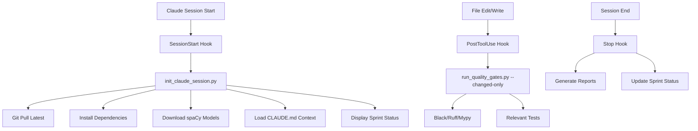

# Script Automation Integration Strategy

## Executive Summary

This document defines the comprehensive integration strategy for the P0 automation scripts (Story 3.5-1 enhancement) with the data-extraction-tool project's existing infrastructure. The strategy covers Claude Code hooks architecture, pre-commit integration, CI/CD pipeline modifications, version control patterns, and testing infrastructure to ensure seamless automation while maintaining backwards compatibility.

## 1. Claude Code Hooks Architecture

### 1.1 File Structure

```
.claude/
├── hooks/
│   ├── SessionStart          # Primary session initialization
│   ├── PostToolUse           # After file edits/writes
│   ├── PreToolUse            # Before operations (future)
│   └── Stop                  # Session cleanup
├── config.yaml               # Hook configuration
└── templates/                # Hook templates for team sharing
    ├── SessionStart.template
    └── PostToolUse.template
```

### 1.2 Hook Execution Flow



### 1.3 Environment Variable Passing

**SessionStart Variables:**
```bash
export DATA_EXTRACT_PROJECT_ROOT=$(pwd)
export DATA_EXTRACT_VIRTUAL_ENV="venv"
export DATA_EXTRACT_PYTHON_VERSION="3.12"
export DATA_EXTRACT_SPRINT_STATUS="docs/sprint-status.yaml"
export DATA_EXTRACT_CLAUDE_CONTEXT="docs/CLAUDE.md"
```

**Hook-to-Script Communication:**
- Use JSON for structured data exchange
- Store temporary state in `.claude/session_state.json`
- Log all operations to `.claude/logs/session-{timestamp}.log`

### 1.4 Error Handling Patterns

**Graceful Degradation:**
```python
# scripts/init_claude_session.py
def setup_session():
    try:
        pull_latest_changes()
    except GitError as e:
        logger.warning(f"Git pull failed: {e}")
        # Continue with local state

    try:
        install_dependencies()
    except DependencyError as e:
        logger.warning(f"Dependency installation failed: {e}")
        # Continue with existing dependencies

    # Always try to load context
    load_context()
    display_sprint_status()
```

**Hook Failure Recovery:**
- Non-blocking: Hook failures don't prevent Claude operations
- Logging: All failures logged to `.claude/logs/`
- Notifications: Critical failures display warning to user
- Fallback: Always have manual command alternatives

## 2. Pre-commit Integration

### 2.1 Updates to `.pre-commit-config.yaml`

```yaml
repos:
  # Existing hooks (black, ruff, mypy)
  - repo: https://github.com/psf/black
    rev: 23.11.0
    hooks:
      - id: black
        language_version: python3.12

  - repo: https://github.com/astral-sh/ruff-pre-commit
    rev: v0.1.6
    hooks:
      - id: ruff

  # Custom project hooks
  - repo: local
    hooks:
      # Story template validation
      - id: validate-story-template
        name: Validate Story Template
        entry: python scripts/validate_story_template.py
        language: python
        files: '^docs/stories/.*\.md$'
        pass_filenames: true
        stages: [commit]

      # Quality gate runner
      - id: quality-gates
        name: Run Quality Gates
        entry: python scripts/run_quality_gates.py --pre-commit
        language: python
        pass_filenames: false
        stages: [push]
        always_run: true

      # Test dependency audit
      - id: check-test-dependencies
        name: Check Test Dependencies
        entry: python scripts/audit_dependencies.py --check
        language: python
        files: '^tests/.*\.py$'
        stages: [commit]

      # Sprint status validation
      - id: validate-sprint-status
        name: Validate Sprint Status
        entry: python scripts/validate_sprint_status.py
        language: python
        files: '^docs/sprint-status\.yaml$'
        stages: [commit]
```

### 2.2 New Hook Definitions

**Story Template Validator:**
- Validates AC table structure
- Checks for required sections
- Ensures evidence placeholders exist
- Validates task/subtask formatting

**Quality Gate Runner:**
- Runs only on push (not every commit)
- Executes black, ruff, mypy sequentially
- Checks coverage thresholds
- Generates quality report

**Dependency Auditor:**
- Scans test files for imports
- Cross-references with pyproject.toml
- Identifies missing dependencies
- Updates dependency documentation

### 2.3 Execution Order and Dependencies

```
1. Format (black) → 2. Lint (ruff) → 3. Type Check (mypy) →
4. Validate Stories → 5. Check Dependencies → 6. Run Tests →
7. Coverage Check → 8. Quality Report
```

**Parallel Execution Groups:**
- Group 1: black, ruff (can run in parallel)
- Group 2: mypy, story validation (after Group 1)
- Group 3: tests, coverage (after Group 2)

## 3. CI/CD Pipeline Integration

### 3.1 GitHub Actions Workflow Modifications

**`.github/workflows/quality-gates.yml`:**
```yaml
name: Quality Gates

on:
  pull_request:
    branches: [main, develop]
  push:
    branches: [main]

jobs:
  quality-checks:
    runs-on: ubuntu-latest
    strategy:
      matrix:
        python-version: ['3.12', '3.13']

    steps:
      - uses: actions/checkout@v4

      - name: Set up Python
        uses: actions/setup-python@v4
        with:
          python-version: ${{ matrix.python-version }}

      - name: Cache dependencies
        uses: actions/cache@v3
        with:
          path: |
            ~/.cache/pip
            venv/
            ~/.cache/pre-commit
            ~/nltk_data
            ~/.spacy
          key: ${{ runner.os }}-pip-${{ hashFiles('**/pyproject.toml') }}

      - name: Install dependencies
        run: |
          python -m venv venv
          source venv/bin/activate
          pip install -e ".[dev]"
          python -m spacy download en_core_web_md

      - name: Run Enhanced Quality Gates
        run: |
          source venv/bin/activate
          python scripts/run_quality_gates.py --ci-mode

      - name: Validate Performance
        run: |
          source venv/bin/activate
          python scripts/validate_performance.py

      - name: Audit Dependencies
        run: |
          source venv/bin/activate
          python scripts/audit_dependencies.py --strict

      - name: Generate Reports
        if: always()
        run: |
          source venv/bin/activate
          python scripts/generate_reports.py \
            --quality \
            --performance \
            --dependencies \
            --output reports/

      - name: Upload Reports
        if: always()
        uses: actions/upload-artifact@v3
        with:
          name: quality-reports
          path: reports/

      - name: Comment PR
        if: github.event_name == 'pull_request'
        uses: actions/github-script@v6
        with:
          script: |
            const fs = require('fs');
            const report = fs.readFileSync('reports/summary.md', 'utf8');
            github.rest.issues.createComment({
              issue_number: context.issue.number,
              owner: context.repo.owner,
              repo: context.repo.repo,
              body: report
            });
```

### 3.2 Quality Gate Execution in CI

**Sequential Execution:**
1. Environment setup (cached)
2. Quality checks (parallel where possible)
3. Performance validation
4. Dependency audit
5. Report generation
6. PR comment with results

**Failure Handling:**
- Quality gate failures block PR merge
- Performance regressions trigger warnings
- Missing dependencies fail the build
- Reports generated even on failure

### 3.3 Artifact Generation and Reporting

**Report Types:**
- `quality-report.json`: Machine-readable results
- `quality-summary.md`: Human-readable summary
- `coverage.xml`: Coverage data for badges
- `performance-baselines.json`: Performance metrics
- `dependency-audit.json`: Dependency analysis

**Report Storage:**
- Artifacts uploaded to GitHub Actions
- Summary posted as PR comment
- Badges updated in README
- Trends tracked in metrics database

## 4. Version Control Strategy

### 4.1 What Gets Committed vs Gitignored

**Committed (version controlled):**
```
scripts/
├── generate_story_template.py      # Core scripts
├── run_quality_gates.py
├── init_claude_session.py
└── templates/                       # Script templates
    └── story.md.j2

.claude/
├── templates/                       # Hook templates
│   ├── SessionStart.template
│   └── PostToolUse.template
└── config.yaml.template             # Configuration template

docs/
├── research/                        # Research and strategy docs
│   ├── script-automation-*.md
│   └── integration-strategy.md
└── processes/                       # Process documentation
    └── automation-workflows.md
```

**Gitignored (not committed):**
```
.claude/
├── hooks/                          # Personal hook implementations
│   ├── SessionStart
│   └── PostToolUse
├── config.yaml                     # Personal configuration
├── session_state.json              # Session state
└── logs/                           # Session logs

.env                                # Environment variables
*.local                             # Local overrides
reports/                            # Generated reports
```

### 4.2 Hook Templates vs Personalized Hooks

**Template Strategy:**
- Provide `.template` files in version control
- Users copy templates to create personal hooks
- Templates include customization points
- Documentation for personalization

**Example Template Structure:**
```bash
#!/bin/bash
# .claude/templates/SessionStart.template

# Load common functions
source .claude/lib/common.sh

# User customization section
# Uncomment and modify as needed:
# export MY_CUSTOM_VAR="value"
# run_custom_script "my_script.py"

# Core initialization (do not modify)
python scripts/init_claude_session.py

# Optional: Add personal workflow steps
# python scripts/my_personal_setup.py
```

### 4.3 Configuration Management

**Three-tier Configuration:**
1. **Project defaults:** Committed in `config.yaml.template`
2. **Team overrides:** In shared team repository
3. **Personal settings:** Local `.claude/config.yaml`

**Configuration Precedence:**
```python
# scripts/load_config.py
def load_configuration():
    config = load_defaults()           # From template
    config.update(load_team_config())  # From team repo
    config.update(load_local_config()) # From local file
    config.update(load_env_vars())     # From environment
    return config
```

## 5. Testing Infrastructure

### 5.1 How to Test Hooks Locally

**Manual Testing Framework:**
```bash
# Test harness script
#!/bin/bash
# scripts/test_hooks.sh

echo "Testing SessionStart hook..."
.claude/hooks/SessionStart
assert_success "SessionStart execution"

echo "Testing PostToolUse hook..."
export CLAUDE_TOOL="Edit"
export CLAUDE_FILE="test.py"
.claude/hooks/PostToolUse
assert_success "PostToolUse execution"

echo "All hook tests passed!"
```

**Automated Hook Testing:**
```python
# tests/integration/test_claude_hooks.py
import subprocess
import pytest
from pathlib import Path

class TestClaudeHooks:
    def test_session_start_hook(self, temp_dir):
        """Test SessionStart hook execution."""
        hook_path = temp_dir / ".claude/hooks/SessionStart"
        result = subprocess.run([str(hook_path)], capture_output=True)
        assert result.returncode == 0
        assert "Session initialized" in result.stdout.decode()

    def test_post_tool_use_hook(self, temp_dir):
        """Test PostToolUse hook with file change."""
        # Create test file
        test_file = temp_dir / "test.py"
        test_file.write_text("print('test')")

        # Run hook
        env = {"CLAUDE_FILE": str(test_file)}
        hook_path = temp_dir / ".claude/hooks/PostToolUse"
        result = subprocess.run([str(hook_path)], env=env, capture_output=True)

        assert result.returncode == 0
        assert "Quality checks passed" in result.stdout.decode()
```

### 5.2 CI Validation of Hooks

**Hook Validation Workflow:**
```yaml
# .github/workflows/validate-hooks.yml
name: Validate Claude Hooks

on:
  pull_request:
    paths:
      - '.claude/**'
      - 'scripts/*_claude_*.py'

jobs:
  validate-hooks:
    runs-on: ubuntu-latest

    steps:
      - uses: actions/checkout@v4

      - name: Setup hook environment
        run: |
          cp .claude/templates/* .claude/hooks/
          chmod +x .claude/hooks/*

      - name: Test SessionStart hook
        run: |
          .claude/hooks/SessionStart
          test -f .claude/session_state.json

      - name: Test PostToolUse hook
        run: |
          echo "test content" > test.py
          CLAUDE_FILE=test.py .claude/hooks/PostToolUse

      - name: Validate hook syntax
        run: |
          shellcheck .claude/hooks/*
          python -m py_compile scripts/*_claude_*.py
```

### 5.3 Mock Environments for Testing

**Mock Claude Environment:**
```python
# tests/mocks/claude_environment.py
class MockClaudeEnvironment:
    """Mock Claude Code environment for testing."""

    def __init__(self, project_root: Path):
        self.project_root = project_root
        self.session_state = {}
        self.environment = {
            "CLAUDE_PROJECT_ROOT": str(project_root),
            "CLAUDE_SESSION_ID": "test-session-123",
            "CLAUDE_USER": "test-user"
        }

    def execute_hook(self, hook_name: str, **kwargs):
        """Execute a hook in mock environment."""
        hook_path = self.project_root / f".claude/hooks/{hook_name}"
        env = {**self.environment, **kwargs}

        result = subprocess.run(
            [str(hook_path)],
            env=env,
            capture_output=True,
            cwd=self.project_root
        )

        return result

    def simulate_file_edit(self, file_path: str, content: str):
        """Simulate Claude editing a file."""
        path = self.project_root / file_path
        path.write_text(content)

        return self.execute_hook(
            "PostToolUse",
            CLAUDE_TOOL="Edit",
            CLAUDE_FILE=str(path)
        )
```

**Integration Test Example:**
```python
def test_full_claude_workflow(mock_claude_env):
    """Test complete Claude session workflow."""
    # Initialize session
    result = mock_claude_env.execute_hook("SessionStart")
    assert result.returncode == 0

    # Simulate file edit
    result = mock_claude_env.simulate_file_edit(
        "src/test.py",
        "def hello(): pass"
    )
    assert result.returncode == 0

    # Clean up session
    result = mock_claude_env.execute_hook("Stop")
    assert result.returncode == 0

    # Verify reports generated
    assert (mock_claude_env.project_root / "reports/session.json").exists()
```

## 6. Implementation Roadmap

### Phase 1: Foundation (Week 1)
1. Enhance story template generator
2. Create quality gate runner
3. Build session initializer
4. Set up basic hooks

### Phase 2: Integration (Week 2)
1. Integrate with pre-commit
2. Update CI/CD pipelines
3. Add hook templates
4. Create test infrastructure

### Phase 3: Validation (Week 3)
1. Test in Claude Code web
2. Run CI validation
3. Team training
4. Documentation finalization

## 7. Success Metrics

### Quantitative Metrics
- Hook execution time: <5 seconds
- Quality gate pass rate: >95%
- CI pipeline time: <10 minutes
- Test coverage: >80%

### Qualitative Metrics
- Developer adoption rate
- Reduced manual tasks
- Improved code quality
- Faster PR cycles

## 8. Risk Mitigation

### Technical Risks
1. **Hook failures blocking work**
   - Mitigation: Non-blocking execution, manual overrides

2. **Performance degradation**
   - Mitigation: Caching, parallel execution, optimization

3. **Cross-platform compatibility**
   - Mitigation: Python-based scripts, thorough testing

### Process Risks
1. **Adoption resistance**
   - Mitigation: Training, documentation, gradual rollout

2. **Over-automation complexity**
   - Mitigation: Keep it simple, provide escape hatches

## Conclusion

This integration strategy provides a comprehensive framework for implementing the P0 automation scripts while maintaining system stability and developer productivity. The phased approach ensures gradual adoption with validation at each step. Success depends on careful implementation, thorough testing, and clear communication with the development team.